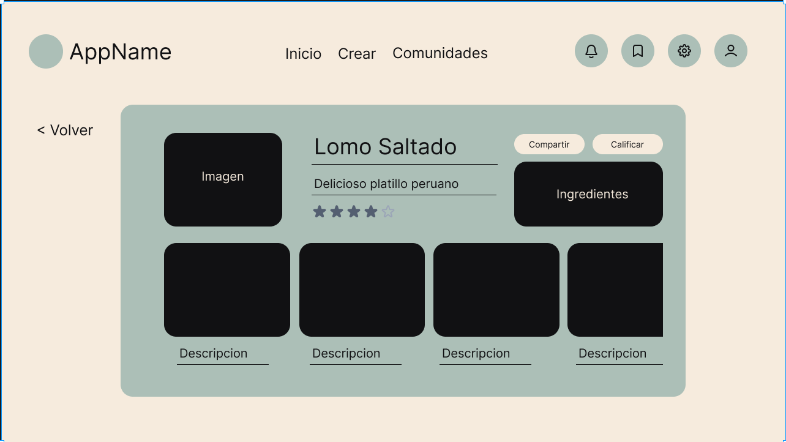
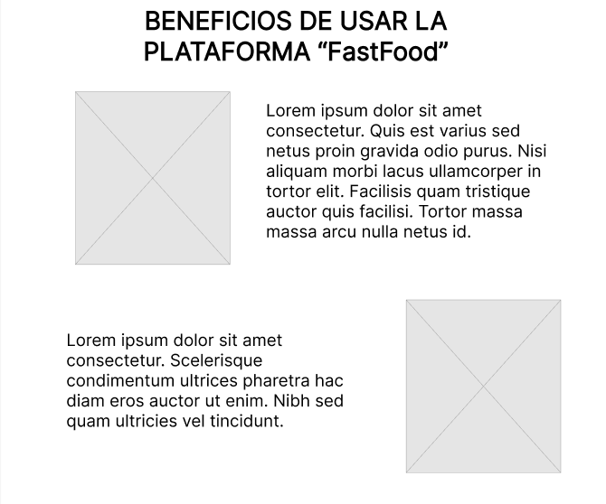
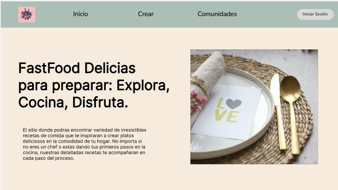

**Universidad Peruana de Ciencias Aplicadas**


Carrera de Ingeniería de Software

Ciclo V

Desarrollo de Aplicaciones Open Source

WS52

Elio Jefferrson Navarrete Vilca

**TB1**

FASTFOOD

  -----------------------------------------------------------------------
  Alumnos             
  ------------------- ---------------------------------------------------
  Código              Apellidos y Nombres

  u202120841          Achamizo Huamani, Jean Carlos

  u20181c241          Castro Soto, Sebastian Enrique

  u201719831          Oliveira Paucar, Mauricio

  u202022018          Torres Alva, Alejandro

  u20201c429          Zagal Vallejo, Nicolás
  -----------------------------------------------------------------------

SEPTIEMBRE 2023


**Registro de Versiones**


|**Versión**|**Fecha**|**Autor**|**Descripción de modificación**|
| :- | :- | :- | :- |
|TB1|Domingo 10 de setiembre|<p>- **Achamizo Huamani, Jean**</p><p>- **Torres Alva, Alejandro**</p><p>- **Castro Soto, Sebastian Enrique**</p><p>- **Oliveira Paucar, Mauricio**</p><p>- **Zagal Vallejo, Nicolás**</p><p></p>|<p>Se han incluido los capítulos:</p><p>● Capítulo I: Introducción</p><p>● Capítulo II: Requirements</p><p>Elicitation & Analysis,</p><p>● Capítulo III: Requirements</p><p>Specification</p><p>● Capítulo IV: Product Design</p><p>● Capítulo V: Product</p><p>Implementation, Validation &</p><p>Deployment</p><p>● Avance de Conclusiones,</p><p>Bibliografía y Anexos</p>|
|TP1||||
|TB2||||
|TF||||


**Student Outcome**


|**Criterio específico**|**Acciones Realizadas**|**Conclusiones**|
| :- | :- | :- |
|Comunica oralmente sus ideas y/o resultados con objetividad a público de diferentes especialidades y niveles jerárquicos, en el marco del desarrollo de un proyecto en ingeniería.|<p>**Achamizo Huamani, Jean**</p><p>**TB1:**</p><p>Junto con el equipo realizamos diferentes reuniones presenciales para  organizar de manera eficiente la solución propuesta.</p><p></p><p>**Oliveira Paucar, Mauricio**</p><p>**TB1:** </p><p>El equipo se reunió y se repartió responsabilidades, después de llegar a un acuerdo en la idea del proyecto.</p><p></p><p>**Torres Alva, Alejandro**</p><p>**TB1:** </p><p>Nos reunimos con el grupo para organizar nuestras ideas y así poder desarrollar un proyecto con más eficiencia.</p><p></p><p>**Castro Soto, Sebastian Enrique**</p><p>**TB1:**</p><p>Nuestro grupo de trabajo desarrollo una idea para hacer el trabajo de manera que sea rentable sin excluir a ninguna persona</p><p></p><p>**Zagal Vallejo, Nicolás**</p><p>**TB1:** </p><p>El grupo se reunió en múltiples ocasiones en función de pulir cada aspecto del proyecto en función de desarrollarlo con la mayor eficiencia posible</p>|<p>**TB1:**</p><p>Se establecieron bases sólidas en términos de requisitos, diseño, desarrollo y pruebas, lo que ha fortalecido nuestra confianza en el futuro del producto. </p><p></p><p>**TP1:**</p><p></p><p>**TB2:**</p><p></p><p>**TF:**</p>|
|Comunica en forma escrita ideas y/o resultados con objetividad a público de diferentes especialidades y niveles jerárquicos, en el marco del desarrollo de un proyecto en ingeniería..|<p>**Achamizo Huamani, Jean**</p><p>**TB1:**</p><p>Nos hemos centrado en una comunicación efectiva con una audiencia diversa, incluyendo usuarios finales y expertos culinarios.</p><p></p><p>**Torres Alva, Alejandro**</p><p>**TB1:**</p><p>Nos centramos en dos públicos objetivos que serían los usuarios y los cocineros, por lo que al tratar con ellos de manera oral para así poder tener ideas más claras para nuestro proyecto.</p><p></p><p>**Castro Soto, Sebastian Enrique**</p><p>**TB1:**</p><p>Según nuestro segmento objetivo e ideas iniciales logramos plazmar en todo el trabajo la idea del aplicativo que conectara cocineros con recetas</p><p></p><p>**Oliveira Paucar, Mauricio**</p><p>**TB1:** </p><p>El equipo llegó a la conclusión de tener dos segmentos objetivos (usuarios y chefs). Logrando asi un mejor resultado para el proyecto.</p><p></p><p>**Zagal Vallejo, Nicolás**</p><p>**TB1:** </p><p>Hemos decidido destacar dos segmentos objetivos para poder conseguir un resultado óptimo en el proyecto destacando las necesidades de cada uno</p><p></p>|<p>***TB1:***</p><p>Nuestro equipo ha demostrado su habilidad para adaptar su comunicación a diferentes especialidades y niveles jerárquicos. Esto es esencial para asegurarse de que el proyecto sea comprensible y útil para todos los involucrados, desde los usuarios finales hasta los chefs que utilizarán la aplicación.</p><p></p><p>***TP1:***</p><p></p><p>***TB2:***</p><p></p><p>***TF:***</p>|


1.1.1. Descripción de la Startup

\"FastFood\" es una innovadora plataforma en línea diseñada para
apasionados de la cocina y amantes de la gastronomía. Nuestra startup se
dedica a proporcionar una experiencia culinaria completa, permitiendo a
los usuarios:

-   **Agregar Recetas Creativas**: Los usuarios pueden registrarse de
    > forma gratuita y compartir sus propias recetas favoritas. Pueden
    > cargar imágenes de sus creaciones culinarias, proporcionar
    > instrucciones detalladas y marcar los ingredientes necesarios.
    > Esto crea una amplia y diversa biblioteca de recetas que van desde
    > las más simples hasta las más sofisticadas.

-   **Comentar y Compartir**: Fomentamos la interacción y la comunidad
    > al permitir que los usuarios comenten las recetas, compartan sus
    > opiniones, hagan preguntas y proporcionen consejos. Esta función
    > de comentarios facilita la colaboración y el aprendizaje entre los
    > amantes de la cocina.

-   **Acceso a Canales Premium de Chefs Reconocidos**: \"FastFood\"
    > ofrece la posibilidad de suscribirse a canales premium de chefs
    > reconocidos a nivel nacional e internacional. Estos chefs
    > comparten sus recetas exclusivas, técnicas de cocina y secretos
    > culinarios a través de videos detallados y tutoriales
    > interactivos. Los suscriptores premium pueden disfrutar de
    > contenido exclusivo y actualizaciones regulares.

-   **Planes de Suscripción Flexibles**: Ofrecemos planes de suscripción
    > flexibles que incluyen una opción gratuita con acceso básico a
    > contenido, así como un plan premium de pago mensual o anual que
    > desbloquea canales premium y beneficios adicionales. Los usuarios
    > pueden elegir el plan que mejor se adapte a sus necesidades y
    > presupuesto.

-   **Contenido Personalizado:** Con el tiempo, nuestra plataforma
    > utiliza algoritmos de recomendación para ofrecer contenido
    > personalizado a los usuarios, sugiriendo recetas y chefs basados
    > en sus preferencias culinarias y hábitos de navegación.

1.1.2. Perfiles de integrantes del equipo

+-----------------------------------+----------------------------------+
| Integrantes                       | Descripción                      |
+===================================+==================================+
| **Nombre**: Jean Carlos Achamizo  | Como estudiante de Ingeniería de |
| Huamani                           | Software en la Universidad UPC,  |
|                                   | mi entusiasmo por el aprendizaje |
| **código**: u202120841            | constante me impulsa a buscar    |
|                                   | siempre nuevas maneras de        |
| **Carrera**: Ingeniería de        | perfeccionar mis habilidades     |
| Software                          | académicas y aplicarlas en       |
|                                   | situaciones prácticas, también   |
| {width="2.6145833333333335in" | Reconozco la importancia de una  |
| height="3.3958333333333335in"}    | comunicación clara y efectiva en |
|                                   | cualquier proyecto de software,  |
|                                   | y cuento con la capacidad de     |
|                                   | escuchar de manera atenta para   |
|                                   | comprender las necesidades y     |
|                                   | expectativas de los clientes y   |
|                                   | colegas de equipo. Mi compromiso |
|                                   | es emplear estas habilidades con |
|                                   | el propósito de alcanzar los     |
|                                   | resultados más óptimos en cada   |
|                                   | proyecto en el que participe.    |
+-----------------------------------+----------------------------------+
| **Nombre**: Alejandro Torres Alva | Como estudiante de la carrera de |
|                                   | Ingeniería de Software en la     |
| **código**: u202022018            | Universidad Peruana de Ciencias  |
|                                   | Aplicadas. Dentro de mis         |
| **Carrera**: Ingeniería de        | habilidades considero que tengo  |
| Software                          | conocimientos básicos en         |
|                                   | programación en c + + y python.  |
| {width="2.9895833333333335in" | me encomienda y si tengo alguna  |
| height="2.625in"}                 | duda llegaría a hablarlo con mi  |
|                                   | grupo.                           |
+-----------------------------------+----------------------------------+
| **Nombre**: Mauricio Oliveira     | Me gusta mucho aprender cosas    |
| Paucar                            | nuevas sobre mi carrera,         |
|                                   | trabajar en equipo de manera     |
| **código**: u201719831            | proactiva y lograr los objetivos |
|                                   | junto a mis compañeros. Me       |
| **Carrera**: Ingeniería de        | considero una persona ambiciosa, |
| Software                          | ya que mi meta es llegar a       |
|                                   | obtener un alto cargo en una     |
| {width="1.4583333333333333in" | software. Gracias a ello siempre |
| height="2.0927088801399827in"}    | podré trabajar en algo que me    |
|                                   | guste y llevar una vida cómoda.  |
|                                   | Cuento con conocimientos de C++  |
|                                   | y HTML.                          |
+-----------------------------------+----------------------------------+
| **Nombre**: Sebastian Enrique     | Mi nombre es Sebastián Enrique   |
| Castro Soto                       | Castro Soto, actualmente         |
|                                   | estudiante de la UPC en la       |
| **código**: u20181c241            | carrera de ingeniería de         |
|                                   | software, tengo experiencia      |
| **Carrera**: Ingeniería de        | trabajando como diseñador de     |
| Software                          | publicidad, diseño de mueblería  |
|                                   | en melamina y conocimiento en    |
| {width="1.7291666666666667in" | de computación, como el manejo   |
| height="2.0862773403324586in"}    | de cualquier tipo de programas   |
|                                   | Microsoft y diseño de programas  |
|                                   | con el lenguaje de programación  |
+-----------------------------------+----------------------------------+
| **Nombre:** Nicolás Zagal Vallejo | Soy estudiante de la carrera de  |
|                                   | Ingeniería de Software. Tengo    |
| **Código**: U20201C429            | conocimientos en lenguajes como  |
|                                   | C++, Python, HTML, CSS y de      |
| **Carrera:** Ingeniería de        | análisis de Base de Datos como   |
| Software                          | SQL y NoSQL. Soy deportista de   |
|                                   | alto rendimiento y selección     |
| {width="1.5572922134733158in" | tiempo con amigos, haciendo      |
| height="1.9808748906386702in"}    | deporte o estudiando nuevos      |
|                                   | temas de diversos ámbitos.       |
+-----------------------------------+----------------------------------+

1.2. Solution Profile

1.2.1. Antecedentes y problemática

> Para abordar esta problemática y destacarse en un mercado competitivo,
> una aplicación de recetas que permita agregar recetas deberá ofrecer
> soluciones a estas limitaciones y necesidades específicas de los
> usuarios. Esto podría incluir características como una plataforma de
> recetas personalizables, herramientas de gestión de ingredientes y
> compras, opciones de colaboración y una base de datos confiable de
> recetas, junto con una interfaz intuitiva para agregar y organizar
> recetas propias.
>
> **Antecedentes:**

1.  **Crecimiento de la Cocina en Casa:** En los últimos años, ha habido
    > un crecimiento significativo en el interés por la cocina casera.
    > Las personas están buscando formas de preparar sus comidas en casa
    > en lugar de comer fuera, lo que ha llevado a un aumento en la
    > búsqueda de recetas y consejos culinarios en línea.

2.  **Aplicaciones de Cocina Existentes:** Ya existen muchas
    > aplicaciones de recetas en el mercado, como AllRecipes, Tasty,
    > Epicurious y muchas más. Estas aplicaciones proporcionan una
    > amplia variedad de recetas, pero algunas pueden carecer de
    > características específicas que los usuarios desean.

3.  **Comunidades de Cocina en Línea:** Además de las aplicaciones,
    > existen numerosas comunidades en línea donde los entusiastas de la
    > cocina comparten sus recetas, trucos y experiencias. Esto
    > demuestra un interés constante en la creación y el intercambio de
    > recetas caseras.

> **Problemática:**

1.  **Fragmentación de la Información:** La información sobre recetas
    > está dispersa en múltiples plataformas y sitios web. Los usuarios
    > a menudo tienen dificultades para encontrar recetas específicas o
    > mantener un registro de sus favoritas.

2.  **Necesidad de Personalización:** Los gustos y preferencias
    > culinarias varían ampliamente entre las personas. Algunas
    > aplicaciones de recetas pueden no ofrecer suficiente
    > personalización, lo que lleva a la insatisfacción de los usuarios
    > que desean adaptar las recetas a sus necesidades dietéticas o
    > gustos personales.

3.  **Agregar y Organizar Recetas Propias:** Los usuarios que desean
    > agregar sus propias recetas a menudo encuentran limitaciones en
    > las aplicaciones existentes. La falta de una función sólida para
    > agregar y organizar recetas personales puede ser una fuente de
    > frustración.

4.  **Gestión de Ingredientes:** La gestión de la lista de ingredientes
    > y la planificación de compras son aspectos importantes de la
    > cocina en casa. Las aplicaciones pueden no ofrecer herramientas
    > efectivas para ayudar a los usuarios a administrar estos aspectos.

5.  **Compartir y Colaborar:** Algunos usuarios pueden desear compartir
    > sus recetas con amigos y familiares o colaborar en la creación de
    > recetas con otros. La falta de funciones de colaboración en
    > algunas aplicaciones puede ser una limitación.

6.  **Necesidad de Recetas Confiables:** La calidad y precisión de las
    > recetas es fundamental. Las aplicaciones deben garantizar que las
    > recetas proporcionadas sean confiables y produzcan resultados
    > satisfactorios.

1.2.2. Lean UX Process

1.2.2.1. Lean UX Problem Statements.

> PS1: Dificultad para decidir qué cocinar
>
> Nuestra startup se enfrenta al desafío de abordar la dificultad que
> enfrentan los usuarios al decidir qué cocinar con los ingredientes que
> tienen en casa. Los usuarios pueden sentirse abrumados y, como
> resultado, optar por opciones repetitivas y monótonas, lo que afecta
> negativamente su experiencia culinaria en el hogar.
>
> ¿Cómo podemos ayudar a los usuarios a tomar decisiones de cocina más
> variadas y emocionantes con lo que tienen a mano?
>
> PS2: Desperdicio de alimentos
>
> Nuestro proyecto también se enfrenta al problema del desperdicio de
> alimentos, ya que muchas personas compran ingredientes que luego no
> utilizan completamente, lo que lleva al desperdicio de alimentos y a
> costos adicionales.
>
> ¿Cómo podemos reducir el desperdicio de alimentos al ayudar a los
> usuarios a aprovechar al máximo los ingredientes que tienen y
> planificar sus comidas de manera más eficiente?
>
> PS3: Falta de inspiración culinaria
>
> Además, hemos identificado que algunos usuarios carecen de inspiración
> para cocinar, lo que los lleva a optar por opciones de comida rápida
> poco saludables en lugar de preparar comidas en casa.
>
> ¿Cómo podemos inspirar a los usuarios y proporcionarles ideas
> creativas para cocinar con los ingredientes disponibles en casa?
>
> PS4: Dificultades para gestionar el inventario de ingredientes
>
> Los usuarios también enfrentan dificultades para gestionar el
> inventario de ingredientes en su cocina, lo que puede resultar en
> compras innecesarias o la falta de elementos clave para una receta.
> Esto puede generar frustración y costos adicionales.
>
> ¿Cómo podemos ayudar a los usuarios a llevar un mejor control de los
> ingredientes que tienen en casa y evitar compras innecesarias?
>
> PS5: Falta de personalización
>
> Algunos usuarios desean recetas más personalizadas que se adapten a
> sus preferencias individuales, como su nivel de habilidad culinaria,
> tiempo disponible para cocinar y gustos individuales.
>
> ¿Cómo podemos ofrecer recetas altamente personalizadas que se adapten
> a las preferencias y limitaciones individuales de cada usuario?

1.2.2.2. Lean UX Assumptions.

> **Business Outcomes**

-   Establecer una fuerte presencia de marca y reconocimiento en el
    > mercado de recetas basadas en ingredientes disponibles,
    > convirtiéndonos en el líder del sector en un plazo de dos años.

-   Obtener una calificación promedio de satisfacción del usuario de al
    > menos 4.5 sobre 5 en las reseñas y comentarios de la plataforma.

-   Alcanzar una tasa de conversión del 10% de usuarios registrados a
    > suscriptores premium en el primer año.

-   Ofrecer una plataforma de recetas que sea altamente personalizable y
    > adaptable a las preferencias culinarias de los usuarios

> **Users**
>
> **Quiénes son los usuarios:**

-   Personas que tienen ingredientes de cocina y desean diversificar sus
    > comidas utilizando lo que tienen a mano.

-   Chefs o expertos culinarios que desean ofrecer tutoriales de cocina
    > y recibir pagos por sus habilidades.

> **Dónde encaja el servicio en sus vidas:**

-   Encaja en la vida cotidiana cuando se requiere preparar una comida y
    > se busca inspiración con los ingredientes disponibles.

-   Encaja en su pasión por la cocina y su deseo de compartir
    > conocimientos y recetas.

> **Qué problemas resuelve:**

-   Aborda la dificultad de decidir qué cocinar con ingredientes
    > limitados.

-   Ofrece soluciones para aquellos con restricciones dietéticas.

-   Proporciona inspiración culinaria y recetas personalizadas.

-   Brinda una plataforma para compartir recetas y experiencias
    > culinarias.

-   Permite a los chefs recibir compensación por sus tutoriales de
    > cocina.

> **Cuándo y cómo se usa el servicio:**

-   Se usa cuando los usuarios desean cocinar con ingredientes
    > disponibles en su cocina.

-   Accesible a través de una aplicación web en un navegador.

-   Se usa para compartir recetas y experiencias culinarias con una
    > comunidad en línea.

-   Los chefs pueden utilizarlo para crear y vender contenido de cocina.

> **User Outcomes:**

-   Posibilidad de descubrir y preparar una variedad de comidas
    > emocionantes y deliciosas con los ingredientes disponibles en
    > casa.

-   Acceso a recetas adaptadas a restricciones dietéticas específicas,
    > lo que permite una alimentación más saludable y variada.

-   Comunidad en línea para compartir recetas, consejos y experiencias
    > culinarias.

-   Recetas personalizadas según las preferencias individuales y el
    > inventario de ingredientes.

> **1.2.2.3. Lean UX Hypothesis Statements.**
>
> Hypothesis Statement 1:
>
> Creemos que al ofrecer una plataforma de recetas altamente
> personalizable y adaptable a las preferencias culinarias de los
> usuarios, aumentaremos la retención y la participación de los
> usuarios.
>
> Sabremos que hemos tenido éxito cuando veamos un aumento significativo
> en el tiempo que los usuarios pasan en la plataforma y un aumento en
> la cantidad de recetas personalizadas creadas por los usuarios.
>
> Hypothesis Statement 2:
>
> Creemos que al fomentar una comunidad en línea donde los amantes de la
> cocina puedan compartir recetas, consejos y experiencias culinarias,
> mejoraremos la satisfacción del usuario y la retención.
>
> Sabremos que hemos tenido éxito cuando veamos un aumento en la
> participación de la comunidad, incluyendo la cantidad de recetas
> compartidas y las interacciones entre usuarios.
>
> Hypothesis Statement 3:
>
> Creemos que al ofrecer una opción de pago seguro y encriptado para los
> usuarios que deseen acceder a contenido premium, aumentaremos la
> conversión de usuarios gratuitos a suscriptores premium.
>
> Sabremos que hemos tenido éxito cuando veamos un aumento en el número
> de suscriptores premium y una disminución en las tasas de abandono de
> la suscripción.

1.2.2.4. Lean UX Canvas.

+-----------------------+-----------------------+-----------------------+
| 1.  **Problem         | > **5. Users ideas:** | 2.  **Business        |
|     > Statements:**   |                       |     > Outcomes:**     |
|                       | Decidir qué cocinar:  |                       |
| PS1: Dificultad para  |                       | Establecer una fuerte |
| decidir qué cocinar   | Generador de Recetas  | presencia de marca y  |
|                       | Personalizado:        | reconocimiento en el  |
| Cómo ayudar a los     | Desarrollar un        | mercado de recetas    |
| usuarios a tomar      | generador de recetas  | basadas en            |
| decisiones de cocina  | que sugiere platos    | ingredientes          |
| más variadas y        | basados en los        | disponibles,          |
| emocionantes con lo   | ingredientes          | convirtiéndonos en el |
| que tienen a mano?    | disponibles en la     | líder del sector en   |
|                       | cocina del usuario.   | un plazo de dos años. |
| PS2: Desperdicio de   | Esto podría incluir   |                       |
| alimentos             | recetas populares y   | Obtener una           |
|                       | opciones              | calificación promedio |
| ¿Cómo reducir el      | personalizadas según  | de satisfacción del   |
| desperdicio de        | las preferencias del  | usuario de al menos   |
| alimentos al ayudar a | usuario.              | 4.5 sobre 5 en las    |
| los usuarios a        |                       | reseñas y comentarios |
| aprovechar al máximo  | Integración de        | de la plataforma.     |
| los ingredientes que  | Escaneo de            |                       |
| tienen y planificar   | Ingredientes:         | Alcanzar una tasa de  |
| sus comidas de manera | Permitir a los        | conversión del 10% de |
| más eficiente?        | usuarios escanear los | usuarios registrados  |
|                       | códigos de barras de  | a suscriptores        |
| PS3: Falta de         | sus ingredientes para | premium en el primer  |
| inspiración culinaria | que la aplicación     | año.                  |
|                       | identifique           |                       |
| Cómo inspirar a los   | automáticamente qué   | Ofrecer una           |
| usuarios y            | ingredientes tienen y | plataforma de recetas |
| proporcionarles ideas | ofrezca recetas       | que sea altamente     |
| creativas para        | relevantes.           | personalizable y      |
| cocinar con los       |                       | adaptable a las       |
| ingredientes          | Desperdicio de        | preferencias          |
| disponibles en casa?  | alimentos:            | culinarias de los     |
|                       |                       | usuarios.             |
|                       | Gestión de Inventario |                       |
|                       | Inteligente: Ofrecer  |                       |
|                       | una función de        |                       |
|                       | gestión de inventario |                       |
|                       | que permita a los     |                       |
|                       | usuarios realizar un  |                       |
|                       | seguimiento de los    |                       |
|                       | ingredientes que      |                       |
|                       | tienen, establecer    |                       |
|                       | fechas de vencimiento |                       |
|                       | y recibir             |                       |
|                       | recordatorios para    |                       |
|                       | utilizar ingredientes |                       |
|                       | antes de que          |                       |
|                       | caduquen.             |                       |
|                       |                       |                       |
|                       | Listas de Compras     |                       |
|                       | Inteligentes: Ayudar  |                       |
|                       | a los usuarios a      |                       |
|                       | crear listas de       |                       |
|                       | compras basadas en    |                       |
|                       | las recetas que       |                       |
|                       | eligen, lo que les    |                       |
|                       | permite comprar sólo  |                       |
|                       | los ingredientes      |                       |
|                       | necesarios.           |                       |
|                       |                       |                       |
|                       | Falta de inspiración  |                       |
|                       | culinaria:            |                       |
|                       |                       |                       |
|                       | Exploración de        |                       |
|                       | recetas: Proporcionar |                       |
|                       | una función de        |                       |
|                       | exploración de        |                       |
|                       | recetas que muestre   |                       |
|                       | platos populares,     |                       |
|                       | tendencias culinarias |                       |
|                       | y recomendaciones     |                       |
|                       | personalizadas para   |                       |
|                       | inspirar a los        |                       |
|                       | usuarios.             |                       |
|                       |                       |                       |
|                       | Desafíos Culinarios:  |                       |
|                       | Lanzar desafíos       |                       |
|                       | culinarios periódicos |                       |
|                       | donde los usuarios    |                       |
|                       | puedan competir       |                       |
|                       | cocinando platos      |                       |
|                       | específicos y ganar   |                       |
|                       | premios.              |                       |
+=======================+=======================+=======================+
| 3.  **Users and       |                       | 4.  **Users           |
|     > customers:**    |                       |     > benefits:\      |
|                       |                       |     > **              |
| Quiénes son los       |                       |                       |
| usuarios:             |                       | Comidas diversas y    |
|                       |                       | emocionantes: los     |
| Personas que tienen   |                       | usuarios pueden       |
| ingredientes de       |                       | descubrir y preparar  |
| cocina y desean       |                       | una variedad de       |
| diversificar sus      |                       | comidas deliciosas y  |
| comidas utilizando lo |                       | emocionantes          |
| que tienen a mano.    |                       | utilizando los        |
|                       |                       | ingredientes que      |
| Chefs o expertos      |                       | tienen a mano. Esto   |
| culinarios que desean |                       | les permite liberarse |
| ofrecer tutoriales de |                       | de las rutinas        |
| cocina y recibir      |                       | culinarias y          |
| pagos por sus         |                       | disfrutar de nuevas   |
| habilidades.          |                       | experiencias          |
|                       |                       | culinarias.           |
|                       |                       |                       |
|                       |                       | Recetas               |
|                       |                       | personalizadas: la    |
|                       |                       | plataforma ofrece a   |
|                       |                       | los usuarios          |
|                       |                       | recomendaciones de    |
|                       |                       | recetas               |
|                       |                       | personalizadas        |
|                       |                       | basadas en sus        |
|                       |                       | preferencias          |
|                       |                       | individuales, niveles |
|                       |                       | de habilidad          |
|                       |                       | culinaria e           |
|                       |                       | ingredientes          |
|                       |                       | disponibles. Esto     |
|                       |                       | asegura que la        |
|                       |                       | experiencia culinaria |
|                       |                       | de cada usuario se    |
|                       |                       | adapte a sus gustos y |
|                       |                       | recursos.             |
|                       |                       |                       |
|                       |                       | Acceso a contenido    |
|                       |                       | personalizado por     |
|                       |                       | chef: los aspirantes  |
|                       |                       | a chefs o expertos    |
|                       |                       | culinarios tienen la  |
|                       |                       | oportunidad de crear  |
|                       |                       | y compartir sus       |
|                       |                       | propios tutoriales y  |
|                       |                       | recetas de cocina.    |
|                       |                       | También pueden        |
|                       |                       | obtener ingresos a    |
|                       |                       | través de la          |
|                       |                       | plataforma ofreciendo |
|                       |                       | contenido premium a   |
|                       |                       | los usuarios          |
|                       |                       | interesados ​​en su     |
|                       |                       | experiencia.          |
+-----------------------+-----------------------+-----------------------+
| **6. Hypothesis**     | **7. What\'s the most | **8. What\'s the      |
|                       | important thing we    | least amount of work  |
| Hypothesis Statement  | need to learn         | we need to do to      |
| 1:                    | first?**              | learn the next most   |
|                       |                       | important thing?**    |
| Creemos que al        | Necesidades del       |                       |
| ofrecer una           | usuario y puntos      | Identificar           |
| plataforma de recetas | débiles: comprender   | competidores clave:   |
| altamente             | los puntos débiles y  | identificar algunos   |
| personalizable y      | las necesidades       | competidores clave en |
| adaptable a las       | específicas de sus    | el mercado.           |
| preferencias          | usuarios objetivo es  |                       |
| culinarias de los     | fundamental. Esto     | Analizar sus          |
| usuarios,             | implica realizar una  | características:      |
| aumentaremos la       | investigación de      | visitar los sitios    |
| retención y la        | usuarios en           | web o aplicaciones    |
| participación de los  | profundidad para      | móviles de estos      |
| usuarios.             | identificar:          | competidores y        |
|                       |                       | explorar sus          |
| Sabremos que hemos    | Qué desafíos          | características.      |
| tenido éxito cuando   | enfrentan los         |                       |
| veamos un aumento     | usuarios a la hora de | Leer reseñas de       |
| significativo en el   | decidir qué cocinar   | clientes: buscar      |
| tiempo que los        | con los ingredientes  | reseñas de clientes y |
| usuarios pasan en la  | que tienen en casa.   | calificaciones de las |
| plataforma y un       |                       | plataformas de sus    |
| aumento en la         | Cómo gestionan        | competidores en       |
| cantidad de recetas   | actualmente los       | tiendas de            |
| personalizadas        | usuarios sus          | aplicaciones, sitios  |
| creadas por los       | inventarios de cocina | web de reseñas o      |
| usuarios.             | y si luchan contra el | redes sociales.       |
|                       | desperdicio de        |                       |
| Hypothesis Statement  | alimentos.            | Precios de la         |
| 2:                    |                       | competencia:          |
|                       | Qué inspira o         | consultar sus modelos |
| Creemos que al        | desalienta a los      | de precios para       |
| fomentar una          | usuarios a cocinar en | comprender cómo       |
| comunidad en línea    | casa.                 | monetizar sus         |
| donde los amantes de  |                       | servicios y si hay    |
| la cocina pueden      | El alcance de las     | funciones premium.    |
| compartir recetas,    | restricciones y       |                       |
| consejos y            | preferencias          | Comentarios de los    |
| experiencias          | dietéticas entre su   | usuarios: analizar    |
| culinarias,           | base de usuarios.     | los comentarios y     |
| mejoraremos la        |                       | opiniones de los      |
| satisfacción del      | Qué motiva a los      | usuarios en           |
| usuario y la          | usuarios a            | plataformas de redes  |
| retención.            | interactuar con       | sociales o foros      |
|                       | comunidades           | comunitarios          |
| Sabremos que hemos    | culinarias y          | relacionados con la   |
| tenido éxito cuando   | plataformas de        | cocina y las recetas. |
| veamos un aumento en  | cocina.               |                       |
| la participación de   |                       | Oportunidades de      |
| la comunidad,         |                       | diferenciación:       |
| incluyendo la         |                       | Identificar áreas     |
| cantidad de recetas   |                       | donde la startup      |
| compartidas y las     |                       | puede diferenciarse   |
| interacciones entre   |                       | de sus competidores.  |
| usuarios.             |                       | ¿Existen necesidades  |
|                       |                       | insatisfechas o       |
| Hypothesis Statement  |                       | segmentos             |
| 3:                    |                       | desatendidos en el    |
|                       |                       | mercado a los que     |
| Creemos que al        |                       | pueda dirigirse?      |
| ofrecer una opción de |                       |                       |
| pago seguro y         |                       |                       |
| encriptado para los   |                       |                       |
| usuarios que deseen   |                       |                       |
| acceder a contenido   |                       |                       |
| premium, aumentaremos |                       |                       |
| la conversión de      |                       |                       |
| usuarios gratuitos a  |                       |                       |
| suscriptores premium. |                       |                       |
|                       |                       |                       |
| Sabremos que hemos    |                       |                       |
| tenido éxito cuando   |                       |                       |
| veamos un aumento en  |                       |                       |
| el número de          |                       |                       |
| suscriptores premium  |                       |                       |
| y una disminución en  |                       |                       |
| las tasas de abandono |                       |                       |
| de la suscripción.    |                       |                       |
+-----------------------+-----------------------+-----------------------+

1.3. Segmentos objetivo.

**Usuarios Casuales de Cocina:**

> **Descripción:** Este segmento está compuesto por personas que
> disfrutan cocinar ocasionalmente en casa y desean aprovechar los
> ingredientes disponibles en su cocina para preparar comidas variadas y
> emocionantes.
>
> **Características Demográficas:** Pueden incluir adultos de diversas
> edades y géneros que tienen acceso a una cocina y desean diversificar
> su alimentación.

**Creadores de Contenido Culinario:**

> **Descripción:** Este segmento se compone de chefs, expertos
> culinarios y creadores de contenido en línea que desean ofrecer
> tutoriales de cocina y compartir sus conocimientos culinarios con una
> audiencia más amplia. Buscan una plataforma para mostrar sus
> habilidades y recibir compensación por su contenido.
>
> **Características Demográficas:** Pueden incluir profesionales de la
> cocina de todas las edades con experiencia en la industria alimentaria
> y una pasión por compartir su conocimiento.

Capítulo II: Requirements Elicitation & Analysis

2.1. Competidores.

2.1.1. Análisis competitivo.

+---------+-------------+--------------+--------------+--------------+
| Comp    |             |              |              |              |
| etitive |             |              |              |              |
| A       |             |              |              |              |
| nalysis |             |              |              |              |
| La      |             |              |              |              |
| ndscape |             |              |              |              |
+=========+=============+==============+==============+==============+
| ¿Por    |             |              |              |              |
| qué     |             |              |              |              |
| llevar  |             |              |              |              |
| a cabo  |             |              |              |              |
| este    |             |              |              |              |
| aná     |             |              |              |              |
| lisis?\ |             |              |              |              |
| El      |             |              |              |              |
| a       |             |              |              |              |
| nálisis |             |              |              |              |
| de      |             |              |              |              |
| compe   |             |              |              |              |
| tidores |             |              |              |              |
| es      |             |              |              |              |
| crucial |             |              |              |              |
| para    |             |              |              |              |
| com     |             |              |              |              |
| prender |             |              |              |              |
| el      |             |              |              |              |
| p       |             |              |              |              |
| anorama |             |              |              |              |
| comp    |             |              |              |              |
| etitivo |             |              |              |              |
| en el   |             |              |              |              |
| que     |             |              |              |              |
| opera   |             |              |              |              |
| nuestro |             |              |              |              |
| s       |             |              |              |              |
| tartup. |             |              |              |              |
| Ayuda a |             |              |              |              |
| iden    |             |              |              |              |
| tificar |             |              |              |              |
| las     |             |              |              |              |
| for     |             |              |              |              |
| talezas |             |              |              |              |
| y       |             |              |              |              |
| debi    |             |              |              |              |
| lidades |             |              |              |              |
| de los  |             |              |              |              |
| compet  |             |              |              |              |
| idores, |             |              |              |              |
| así     |             |              |              |              |
| como    |             |              |              |              |
| las     |             |              |              |              |
| oportu  |             |              |              |              |
| nidades |             |              |              |              |
| y       |             |              |              |              |
| a       |             |              |              |              |
| menazas |             |              |              |              |
| en el   |             |              |              |              |
| m       |             |              |              |              |
| ercado. |             |              |              |              |
| Esto    |             |              |              |              |
| nos     |             |              |              |              |
| pe      |             |              |              |              |
| rmitirá |             |              |              |              |
| tomar   |             |              |              |              |
| dec     |             |              |              |              |
| isiones |             |              |              |              |
| inf     |             |              |              |              |
| ormadas |             |              |              |              |
| y       |             |              |              |              |
| desa    |             |              |              |              |
| rrollar |             |              |              |              |
| estr    |             |              |              |              |
| ategias |             |              |              |              |
| ef      |             |              |              |              |
| ectivas |             |              |              |              |
| para    |             |              |              |              |
| diferen |             |              |              |              |
| ciarnos |             |              |              |              |
| y       |             |              |              |              |
| c       |             |              |              |              |
| ompetir |             |              |              |              |
| con     |             |              |              |              |
| éxito.  |             |              |              |              |
+---------+-------------+--------------+--------------+--------------+
| Nombre  |             | Tasty de     | AllRecipes   | YouTube      |
|         |             | BuzzFeed     |              |              |
+---------+-------------+--------------+--------------+--------------+
| Logo    |             | {width | e5.png){widt | 3.png){width |
|         |             | ="1.21875in" | h="1.2395833 | ="1.21875in" |
|         |             | height       | 333333333in" | height       |
|         |             | ="0.56944444 | height       | ="0.69444444 |
|         |             | 44444444in"} | ="0.65277777 | 44444444in"} |
|         |             |              | 77777778in"} |              |
+---------+-------------+--------------+--------------+--------------+
| Perfil  | Overview    | Tasty es     | AllRecipes   | YouTube es   |
|         |             | conocida por | es una       | una          |
|         |             | sus videos   | plataforma   | plataforma   |
|         |             | virales de   | global de    | de video en  |
|         |             | recetas en   | recetas en   | línea donde  |
|         |             | línea y      | línea que    | creadores de |
|         |             | tiene una    | ofrece una   | contenido    |
|         |             | amplia       | amplia       | comparten    |
|         |             | presencia en | variedad de  | una amplia   |
|         |             | las redes    | recetas y    | variedad de  |
|         |             | sociales.    | consejos     | videos,      |
|         |             | Ofrece una   | culinarios.  | incluyendo   |
|         |             | variedad de  |              | recetas y    |
|         |             | recetas y    |              | consejos     |
|         |             | contenido    |              | culinarios.  |
|         |             | culinario    |              |              |
|         |             | visualmente  |              |              |
|         |             | atractivo.   |              |              |
+---------+-------------+--------------+--------------+--------------+
|         | Ventaja     | Su enfoque   | Ofrece una   | Amplio       |
|         |             | en contenido | gran         | alcance y    |
|         | competitiva | visual y     | cantidad de  | diversidad   |
|         |             | compartible  | recetas con  | de contenido |
|         | ¿Qué valor  | en redes     | una          | culinario,   |
|         |             | sociales la  | comunidad    | desde        |
|         | ofrece a    | hace         | activa de    | recetas      |
|         | los         | atractiva    | revisores    | caseras      |
|         |             | para         | que dan      | hasta alta   |
|         | clientes    | usuarios que | feedback     | cocina.      |
|         |             | buscan       | sobre las    |              |
|         |             | inspiración  | recetas.     |              |
|         |             | rápida para  |              |              |
|         |             | cocinar.     |              |              |
+---------+-------------+--------------+--------------+--------------+
| Perfil  | Mercado     | Usuarios     | Usuarios     | Usuarios     |
| de      |             | interesados  | interesados  | interesados  |
|         | Objetivo    | en recetas y | en recetas y | en todo tipo |
| Ma      |             | consejos     | consejos     | de           |
| rketing |             | culinarios,  | culinarios   | contenido,   |
|         |             | en           | de todo      | incluyendo   |
|         |             | particular,  | tipo.        | recetas y    |
|         |             | aquellos que |              | consejos     |
|         |             | buscan       |              | culinarios.  |
|         |             | contenido    |              |              |
|         |             | visualmente  |              |              |
|         |             | atractivo y  |              |              |
|         |             | fácil de     |              |              |
|         |             | seguir.      |              |              |
+---------+-------------+--------------+--------------+--------------+
|         | Estrategias | Uso de       | Contenido de | Publicación  |
|         |             | videos       | calidad,     | constante de |
|         | de          | virales en   | comunidad    | videos,      |
|         |             | plataformas  | activa de    | co           |
|         | Marketing   | de redes     | usuarios, y  | laboraciones |
|         |             | sociales,    | presencia en | con chefs    |
|         |             | co           | redes        | populares y  |
|         |             | laboraciones | sociales.    | creadores de |
|         |             | con chefs    |              | contenido.   |
|         |             | populares y  |              |              |
|         |             | la marca de  |              |              |
|         |             | BuzzFeed     |              |              |
|         |             | para         |              |              |
|         |             | aumentar la  |              |              |
|         |             | visibilidad. |              |              |
+---------+-------------+--------------+--------------+--------------+
| Perfil  | Productos   | Videos de    | Recetas,     | Videos de    |
| de      |             | recetas,     | consejos,    | recetas,     |
|         | y Servicios | artículos    | comunidad de | consejos     |
| P       |             | informativos | cocina.      | culinarios,  |
| roducto |             | y contenido  |              | contenido    |
|         |             | relacionado  |              | relacionado  |
|         |             | con la       |              | con la       |
|         |             | comida.      |              | comida.      |
+---------+-------------+--------------+--------------+--------------+
|         | Precios y   | La mayoría   | La mayoría   | Mayormente   |
|         |             | del          | del          | gratuito,    |
|         | Costos      | contenido es | contenido es | ingresos a   |
|         |             | gratuito; es | gratuito,    | través de    |
|         |             | posible que  | ingresos a   | publicidad y |
|         |             | generen      | través de    | s            |
|         |             | ingresos a   | publicidad y | uscripciones |
|         |             | través de    | posiblemente | premium.     |
|         |             | publicidad y | contenido    |              |
|         |             | patrocinios. | premium.     |              |
+---------+-------------+--------------+--------------+--------------+
|         | Canales de  | Plataformas  | Su sitio web | Plataforma   |
|         |             | de redes     | y            | web y        |
|         | d           | sociales y   | aplicaciones | aplicaciones |
|         | istribución | su propio    | móviles.     | móviles.     |
|         | (Web y/o    | sitio web.   |              |              |
|         |             |              |              |              |
|         | móvil)      |              |              |              |
+---------+-------------+--------------+--------------+--------------+
| A       | Fortalezas  | Contenido    | Su sitio web | Plataforma   |
| nálisis |             | altamente    | y            | web y        |
|         |             | compartible, | aplicaciones | aplicaciones |
| SWOT    |             | marca de     | móviles.     | móviles.     |
|         |             | confianza de |              |              |
|         |             | BuzzFeed.    |              |              |
+---------+-------------+--------------+--------------+--------------+
|         | Debilidades | Puede        | Puede ser    | La calidad   |
|         |             | carecer de   | abrumador    | del          |
|         |             | pers         | debido a la  | contenido    |
|         |             | onalización, | cantidad de  | varía, puede |
|         |             | enfoque más  | recetas.     | requerir     |
|         |             | en recetas   |              | tiempo para  |
|         |             | generales.   |              | encontrar    |
|         |             |              |              | contenido    |
|         |             |              |              | específico.  |
+---------+-------------+--------------+--------------+--------------+
|         | Op          | Mayor        | Pers         | Colaboración |
|         | ortunidades | pers         | onalización, | con chefs    |
|         |             | onalización, | contenido    | locales,     |
|         |             | co           | premium.     | contenido    |
|         |             | laboraciones |              | premium,     |
|         |             | con chefs    |              | pers         |
|         |             | locales.     |              | onalización. |
+---------+-------------+--------------+--------------+--------------+
|         | Amenazas    | Competencia  | Competencia  | Colaboración |
|         |             | de otras     | de otras     | con chefs    |
|         |             | plataformas  | plataformas  | locales,     |
|         |             | de recetas   | de recetas.  | contenido    |
|         |             | en línea.    |              | premium,     |
|         |             |              |              | pers         |
|         |             |              |              | onalización. |
+---------+-------------+--------------+--------------+--------------+

> 2.1.2. Estrategias y tácticas frente a competidores.

-   Diferenciación: Destacar la personalización de recetas, la comunidad
    > de chefs locales y la interacción con usuarios para diferenciarnos
    > de la competencia.

-   Contenido de Alta Calidad: Asegurarnos que nuestro contenido,
    > incluyendo los videotutoriales de chefs, sea de la más alta
    > calidad y esté en diversos idiomas para satisfacer las necesidades
    > de los usuarios.

-   Colaboraciones Locales: Colaborar con chefs y expertos culinarios
    > peruanos para ofrecer contenido exclusivo y auténtico.

-   Personalización: Ofrecer una experiencia altamente personalizada en
    > la plataforma, adaptándonos a las preferencias y restricciones
    > dietéticas de nuestros usuarios.

-   Marketing en Redes Sociales: Utiliza estrategias de marketing en
    > redes sociales para aumentar la visibilidad y el compromiso de la
    > plataforma.

-   Planes de Monetización Claros: Desarrolla planes de monetización que
    > sean transparentes y ofrezcan valor a los usuarios, como contenido
    > premium o suscripciones.

-   Análisis Continuo: Realiza un seguimiento constante de la evolución
    > del mercado y de las estrategias de tus competidores para
    > adaptarte a los cambios y oportunidades emergentes.

\-\-\-\-\-\-\-\-\-\-\-\-\-\-\-\-\-\-\-\-\-\-\-\-\-\-\-\-\-\-\-\-\-\-\-\-\-\-\-\-\-\-\-\-\-\-\-\-\-\-\-\-\-\-\-\-\-\-\-\-\-\-\-\-\-\-\-\-\-\-\-\-\-\-\-\-\-\-\-\-\-\-\-\-\-\-\--

2.2. Entrevistas.

2.2.1. Diseño de entrevistas.

> Entrevista para cocineros casuales

-   ¿Cuál es su nombre, edad y en donde ha estudiado cocina?

-   ¿Cuál es tu experiencia en la cocina y cuánto tiempo has estado
    > cocinando profesionalmente?

-   ¿Cómo te mantienes al tanto de las tendencias culinarias?

-   ¿Qué medidas tomas para garantizar seguridad e higiene en la cocina?

-   ¿Has trabajado previamente en la creación de contenido culinario en
    > línea, como blogs, videos o aplicaciones similares?

-   ¿Qué herramientas o software utilizas para gestionar y organizar
    > recetas?

-   ¿Te gustaría unirte a un aplicativo de recetas en lugar de trabajar
    > tradicionalmente?

> Entrevista para clientes

-   ¿Cuál es su nombre y edad?

-   ¿Tienes dificultades al buscar recetas o tutoriales de como cocinar
    > algún plato en específico?

-   ¿Cuál es tu nivel de experiencia en la cocina? ¿Buscas recetas
    > fáciles o desafiantes?

-   ¿Te gustaría encontrar recetas rápidas para cocinar durante la
    > semana o platos más elaborados para ocasiones especiales?

-   ¿Estás interesado en aprender nuevas técnicas culinarias o
    > simplemente quieres recetas familiares?

-   ¿Tienes algún ingrediente en particular que te gustaría usar o
    > evitar en tus recetas?

-   ¿Te gustaría guardar tus recetas favoritas o llevar un registro de
    > tus creaciones en la aplicación?

-   ¿Tienes alguna aplicación o plataforma de recetas favorita hasta
    > ahora?

-   ¿Te gustaría un aplicativo con una amplia cantidad de recetas,
    > también como videos consultando la receta seleccionada y más?

2.2.2. Registro de entrevistas.

> Segmento Cocinero Casual
>
> Entrevista 1
>
> Entrevistado: Vivian Torres
>
> Años: 24 años
>
> Centro de estudio: SISE
>
> Vivian nos menciona que tiene experiencia cocinando en restaurantes
> variados y después se dedicó a estudiar cocina ya de manera
> profesionalmente. También, que se entera de todo el mundo gastronómico
> por cursos aparte que lleva y más que nada las redes (YouTube, otras
> plataformas). Además, no tiene mucha experiencia en la creación de
> contenido audiovisual y que maneja Excel y Google Keep para la
> creación de recetas. Finalmente nos comenta que estaría a favor por el
> hecho que en la actualidad se trabaja más de manera virtual.

{width="6.267716535433071in"
height="1.8194444444444444in"}

> Link:
> [[https://youtu.be/a3uk0Io2ISE]{.underline}](https://youtu.be/a3uk0Io2ISE)
>
> Entrevista 2
>
> Entrevistado: Enzo Meza
>
> Años: 25 años
>
> Centro de estudio: INTECI
>
> Enzo nos menciona que tiene experiencia en su mismo instituto
> trabajando y posteriormente trabajo en restaurantes de manera
> profesional siendo asistente. También, que se entera del mundo de la
> gastronomía a partir de periódicos online donde ve contenido de
> cocina, innovaciones, restaurantes. Además, tiene algo de experiencia
> en crear contenido audiovisual, pero de manera aficionada mostrando
> como un blog de la vida que tiene un cocinero mostrando sus rutinas.
> Por otra parte, nos dice que no tiene tanta experiencia usando
> herramientas o software para agilizar las recetas lo hace de manera
> tradicional agarrando una hoja en blanco y rellenando a mano.
> Finalmente, nos comenta que parece buena la iniciativa de llegar a más
> personas en un aplicativo para personas que no tengan experiencia en
> la cocina.
>
> {width="6.267716535433071in"
> height="1.8888888888888888in"}
>
> Link:
> [[https://youtu.be/fYcDg89XNPk]{.underline}](https://youtu.be/fYcDg89XNPk)
>
> Entrevista 3
>
> Entrevistado: Doris Alva
>
> Años: 56 años
>
> Centro de estudio: No cuenta con estudio profesional
>
> Doris nos menciona que tiene experiencia trabajando en restaurantes
> cocinando platos comunes. También, que se entera de la gastronomía en
> YouTube viendo videos que se les hace interesante. Además, que cuenta
> con muy poca experiencia en lo que sería multimedia, pero para el
> momento de las recetas guarda los enlaces de algún contenido que le
> guste y también lo apunto en un block de notas. Finalmente, nos
> comenta que le parece interesante el aplicativo y le gustaría unirse
> si se diera el caro porque como ya tiene mucha experiencia en la
> cocina podría brindar sus conocimientos como un pasatiempo.

{width="6.267716535433071in"
height="1.8333333333333333in"}

> Link:
> [[https://youtu.be/BhaA6LFw_AE]{.underline}](https://youtu.be/BhaA6LFw_AE)
>
> Segmento cliente
>
> Entrevista 1
>
> Entrevistado: Boris Garro
>
> Edad: 20 años
>
> Boris nos comenta que para buscar alguna receta para poder cocinar
> alguna comida más que nada se fija en contenido de YouTube descartando
> los blogs de recetas. También, que le gustaría tener experiencia
> cocinando ni bien de recetas fáciles como los hace habitualmente y
> también de recetas más elaboradas que requieren un poco más de
> complejidad. Además, nos comenta que para su comida sana sugiere
> evitar los aceites para sus platos. Así mismo, nos dice que le
> encontraría genial si encontrara un aplicativo con registro de recetas
> donde puede modificarlo y poner en favoritos para no tener que
> buscarlo nuevamente. Finalmente, nos dice que le parece muy
> interesante la idea de este aplicativo si se llegara a encontrar con
> uno que le brinde todas esas opciones de facilidad al momento de
> buscar una receta
> online.{width="6.267716535433071in"
> height="1.8333333333333333in"}
>
> Link:
> [[https://youtu.be/Xk0-KXiMjDI]{.underline}](https://youtu.be/Xk0-KXiMjDI)
>
> Entrevista 2
>
> Entrevistado: Guillermo Cuadros
>
> Edad: 21 años
>
> Guillermo nos comenta que para buscar recetas comunes es relativamente
> muy sencillo de encontrar, pero las comidas que requieren un poco más
> de complejidad no los encuentra o muy rebuscados. También, que
> mayormente busca recetas simples descartando las complicadas; sin
> embargo, cuando se dé una fecha especial si se tomará el tiempo de
> preparar algo más elaborado. Además, le agrada mucho el uso del chuño
> por su consistencia que le brinda a sus comidas. Así mismo, no se
> tomaría tanto la molestia de guardar algunas recetas porque sólo
> cocina para poder subsistir, pero si llegara el momento en el cual
> esté más interesado esa función se le haría una necesidad. Finalmente,
> estaría interesado en un aplicativo así ya que sería muy accesible
> para las personas que estén buscando cocinar.
>
> {width="6.267716535433071in"
> height="1.8194444444444444in"}
>
> Link:
> [[https://youtu.be/iSM7lJKWKjs]{.underline}](https://youtu.be/iSM7lJKWKjs)
>
> Entrevista 3
>
> Entrevistado: Marco Romero
>
> Edad: 21 años
>
> Marco nos comenta que, si muestra dificultad al buscar recetas, ya que
> en la mayoría de las recetas que encuentra solo le mencionan los
> ingredientes y al elaborarlo no le sale como esperaba. También nos
> dice que no tiene mucho nivel de cocina, pero igual busca recetas
> desafiantes porque mayormente las preparaciones más elaboradas son más
> deliciosas. Además, que le gusta a veces salir de su zona de confort
> de preparar lo habitual así buscando recetas más laboriosas. Así
> mismo, que si le gustaría algún aplicativo que le pueda administrar
> sus recetas, ya que más usa YouTube para la cocina y usualmente los
> videos que utiliza se pierden o no los vuelve a encontrar de manera
> sencilla. Finalmente, nos menciona que le encuentra genial, ya que al
> tener una amplia búsqueda de recetas y también contenido audiovisual
> para poder prepararlos es de gran ayuda para los que son novatos.

{width="6.267716535433071in"
height="1.8055555555555556in"}

> Link:
> [[https://youtu.be/VHh2luwKPzI]{.underline}](https://youtu.be/VHh2luwKPzI)
>
> 2.2.3. Análisis de entrevistas.
>
> Análisis para el sector de Cocinero

-   En el caso de la experiencia cocinando en todos los casos si tienen
    > experiencia, pero no todos lo han logrado haciendo estudios
    > profesionales de la gastronomía.

-   Para el caso de cómo se mantienen al tanto de la gastronomía mundial
    > en los casos que sí han estudiado una carrera de gastronomía se
    > enteran de mundo de la gastronomía por foros de internet de
    > páginas oficiales, YouTube y cursos aparte sobre esos temas; y
    > para el caso que no terminaron o hicieron una carrera gastronómica
    > solo lo hacen por medio de publicaciones en Facebook, Instagram y
    > YouTube.

-   Para el caso de si han tenido experiencia con contenido culinario en
    > línea en los casos de los que tienen una carrera tienen una
    > experiencia media, ya que lo habrán hecho, pero a manera de Blogs
    > amateur no como contenido oficial; y en el caso de los que no
    > tienen carrera no tienen experiencia con los videos.

-   Para el caso de herramientas y software nos comenta que usan Excel,
    > herramientas de Google y hoja en blanco para poner sus apuntes.

-   Finalmente, según la encuesta las personas lo toman como buena idea
    > la de crear un aplicativo que cumpla con las funciones de brindar
    > una amplia búsqueda de recetas para lo que quiera el cliente.

> Análisis para el sector de Cliente

-   En el caso de la complejidad de buscar recetas es un caso
    > intermedio, ya que ni bien algunos nos mencionan que les es fácil
    > encontrar recetas para sus situaciones claro que se toman un buen
    > tiempo para encontrarla, también está el caso que simplemente solo
    > busca en YouTube y le da a la primera opción y el que, si se le
    > dificulta al buscar estas, ya que no encuentra una que tengan
    > todas las características que él esperaba.

-   Para el caso de experiencia en todos los casos nos dicen que no
    > cuenta con mucha experiencia solo cocinan como un pasatiempo o
    > cuando están solos y para el momento de buscar una receta para
    > cocinar nos mencionan que simplemente buscan la receta más
    > sencilla, pero cuando disponen de tiempo o es una fecha especial
    > se toman la molestia de preparar una receta más elaborada.

-   Para el caso de aprender nuevas recetas la mitad opta por no
    > aprender recetas, ya que no tienen como hobby o no les gusta tanto
    > cocinar, pero la otra mitad si estarían buscando recetas
    > desafiantes para que también puedan aprender a cocinar.

-   Para el caso de guardar recetas en un aplicativo en todos los casos
    > nos mencionan que les gustaría tener un aplicativo que pueda
    > almacenar sus recetas favoritas cuando quieran volver a usarlas
    > para su cocina.

-   Para el caso de si tienen algún aplicativo preferencial para guardar
    > recetas o búsqueda de estas, en todos los casos pasa que no
    > cuentan con uno y si ni bien encuentran una pagina de recetas no
    > son más que foros donde la gente publica recetas comunes, pero no
    > cuentan con esta opción que sería guardar recetas o
    > personalizarlas.

-   Finalmente con la pregunta de si estarían complacidos de usar un
    > aplicativo que cumpla con las características de brindar recetas
    > con una amplia búsqueda de estas más contenido audiovisual para
    > que facilite en la preparación de la comida, en todos los casos la
    > gente estaría complacida, ya que sería un aplicativo que cumpla
    > con muchas características que quizás otros apps o foros no
    > cuenten y estarían dispuestos a usarlo.

2.3. Needfinding.

2.3.1. User Personas.

> User Persona de el usuario Cocinero Casual

{width="6.267716535433071in"
height="6.208333333333333in"}

> User persona del usuario Chef

{width="6.267716535433071in"
height="6.916666666666667in"}

2.3.2. User Task Matrix.

  -----------------------------------------------------------------------------------------------
  **Tarea de Usuario**      **Daniela                          **Roberto        
                            Fabian**                           Cardenaz**       
  ------------------------- ---------------- ----------------- ---------------- -----------------
                            **Frecuencia**   **Importancia**   **Frecuencia**   **Importancia**

  **Seleccionar una         Always           High              Usually          High
  receta**                                                                      

  **Comprobar la            Rarely           High              Always           High
  disponibilidad de                                                             
  ingredientes**                                                                

  **Crear una lista de      Usually          Medium            Rarely           High
  compras**                                                                     

  **Medir ingredientes**    Rarely           High              Always           High

  **Cortar y picar          Rarely           Medium            Always           High
  ingredientes**                                                                

  **Marinado y preparación  Rarely           High              Always           High
  previa**                                                                      

  **Monitorear el tiempo de Usually          High              Always           High
  cocción**                                                                     

  **Decorar y emplatar**    Usually          Low               Always           High
  -----------------------------------------------------------------------------------------------

> 2.3.3. User Journey Mapping.

{width="6.267716535433071in"
height="4.416666666666667in"}

> 2.3.4. Empathy Mapping.

Empathy Mapping del usuario Cocinero Casual

{width="6.267716535433071in"
height="7.111111111111111in"}

Empathy Mapping del usuario Cocinero Profesional

{width="6.267716535433071in"
height="7.638888888888889in"}

> 2.3.5. As-is Scenario Mapping.
>
> As-is scenario map cuando un usuario está colocando los ingrediente
> para encontrar una receta.

+-----+---------------+---------------+---------------+--------------+
| pha | Busca entre   | Busca un      | Compara los   | *Cocina la   |
| ses | las múltiples | recetario de  | ingredientes  | receta.*     |
|     | recetas del   | cocina.       | que le piden  |              |
|     | libro o       |               | con los que   |              |
|     | página.       |               | tiene en      |              |
|     |               |               | casa.         |              |
+=====+===============+===============+===============+==============+
| Do  | -   Reviso    | -   Pregunto  | -   Revisó    | -   Preparó  |
| ing |     muchas    |     a amigos  |     los       |     con      |
|     |     rectas    |     para      |               |     todos    |
|     |     para ver  |     hacer     |  ingredientes |     los      |
|     |     cual      |     recetas.  |     que tengo |              |
|     |     puedo     |               |     y que me  | ingredientes |
|     |     hacer en  | -   Busco     |     falta     |     la       |
|     |     ese       |     entre los |     para      |     receta   |
|     |     instante. |     viejos    |     realizar  |              |
|     |               |     libros un |     la        |    escogida. |
|     | -   Decido    |     recetario |     comida.   |              |
|     |     entre     |     de        |               |              |
|     |     muchas    |     comida.   | -   Salgo a   |              |
|     |     una de    |               |     comprar   |              |
|     |     las       | -   Revisó en |     los       |              |
|     |     recetas.  |     paginas o |               |              |
|     |               |     videos    |  ingredientes |              |
|     |               |     por       |     que       |              |
|     |               |     internet  |     faltan en |              |
|     |               |     de comida |     mi        |              |
|     |               |     fácil y   |     cocina.   |              |
|     |               |     rápida.   |               |              |
+-----+---------------+---------------+---------------+--------------+
| Th  | -   Espero    | -   No puedo  | -   Algunos   | -   Tengo    |
| ink |     que los   |     creer que |               |     que      |
| ing |     libros de |     sea tan   |  ingredientes |              |
|     |     receta    |               |     no tengo  |   asegurarme |
|     |     tengan    |    complicado |     en casa,  |     de       |
|     |     algo que  |     encontrar |     tendré    |     colocar  |
|     |     me guste. |     una       |     que salir |     las      |
|     |               |     receta.   |     a         |     medidas  |
|     | -   Existen   |               |               |              |
|     |     muchas    | -   Ojala     |    comprarlo. |   correctas. |
|     |     páginas   |     encontrar |               |              |
|     |     de        |     una       | -   Muestran  | -   Debo     |
|     |     cocina,   |     receta    |               |     apuntar  |
|     |     me        |     fácil y   |  ingredientes |     la       |
|     |     complico  |     rápida de |     que no    |     receta   |
|     |     quedarme  |     hacer     |     existen   |     para     |
|     |     con una   |               |     en mi     |     hacerla  |
|     |     de ellas. |               |     mercado   |     otro     |
|     |               |               |     local.    |     día.     |
+-----+---------------+---------------+---------------+--------------+
| F   | -   Angustia  | -             | -             | -   Miedo    |
| eel |     por no    | Incertidumbre |  Preocupación |     por      |
| ing |     encontrar |     por la    |     por no    |     saber si |
|     |     un libro  |     comida    |     encontrar |     no sabe  |
|     |     de        |     que no sé |     los       |     rico la  |
|     |     recetas   |     si sabrá  |               |     comida.  |
|     |     en mi     |     rico.     |  ingredientes |              |
|     |     casa.     |               |     mostrados |              |
|     |               | -   Ansiedad  |     en la     |              |
|     | -             |     por       |     receta.   |              |
|     |   Frustración |     averiguar |               |              |
|     |     por el    |     las       | -             |              |
|     |     tiempo    |               | Incertidumbre |              |
|     |     que busco |    diferentes |     de que    |              |
|     |     en        |     recetas   |     todos los |              |
|     |     paginas   |     que       |               |              |
|     |     de cocina |     existen.  |  ingredientes |              |
|     |     algo      |               |     sen       |              |
|     |     bueno.    |               |               |              |
|     |               |               |    encuentren |              |
|     |               |               |     a mi      |              |
|     |               |               |               |              |
|     |               |               |  disposición. |              |
+-----+---------------+---------------+---------------+--------------+

Capítulo III: Requirements Specification

3.1. To-Be Scenario Mapping

To-Be scenario map cuando un usuario está colocando los ingredientes
para encontrar una receta.

+------+----------------+---------------+--------------+--------------+
| Ph   | Busca una      | Prueba la     | Encuentra    | Cocina con   |
| ases | aplicación de  | aplicación    | múltiples    | la receta    |
|      | recetas        |               | rectas.      | mostrada.    |
|      | culinarias.    |               |              |              |
+======+================+===============+==============+==============+
| D    | -   Busco un   | -   Abro la   | -   Decido   | -   Preparé  |
| oing |     app que me |               |     que      |     la       |
|      |     ayude a    |   aplicación. |     quiero   |     comida   |
|      |     cocinar.   |               |     comer    |     que mas  |
|      |                | -   Mencionó  |     entre    |     me       |
|      | -   Revisó     |     los       |     las que  |     gusto,   |
|      |     múltiples  |               |     me       |     solo con |
|      |     páginas    |  ingredientes |     muestra  |     los      |
|      |                |     que tengo |     la       |              |
|      |    culinarias. |     en el     |              | ingredientes |
|      |                |     hogar.    |  aplicación. |     del      |
|      |                |               |              |     hogar.   |
|      |                | -             | -   Veo      |              |
|      |                |    Específico |     mucha    | -            |
|      |                |     qué tipo  |     variedad |              |
|      |                |     de comida |     con mis  |              |
|      |                |     quiero.   |              |              |
|      |                |               |    productos |              |
|      |                |               |     en casa  |              |
|      |                |               |     y        |              |
|      |                |               |     algunas  |              |
|      |                |               |     que      |              |
|      |                |               |     necesito |              |
|      |                |               |     unos     |              |
|      |                |               |              |              |
|      |                |               | ingredientes |              |
|      |                |               |     más.     |              |
+------+----------------+---------------+--------------+--------------+
| Thin | -   Hay muchas | -   Esta      | -   Vaya qué | -   Que      |
| king |                |               |     variedad |     fácil    |
|      |   aplicaciones |    aplicación |     de       |     fue      |
|      |     parecidas, |     tiene las |     recetas  |              |
|      |     pero esta  |     ca        |     con      |    encontrar |
|      |     destaca    | racterísticas |     estos    |     y        |
|      |     entre las  |     que       |     i        |     preparar |
|      |     demás.     |     busco.    | ngredientes, |     una      |
|      |                |               |     no me    |     receta   |
|      |                | -   Me gusta  |              |     en esta  |
|      |                |     esta      |    imaginaba |              |
|      |                |               |     que      |  aplicación. |
|      |                |    aplicación |     podía    |              |
|      |                |     ya que es |     haber    | -   Que rico |
|      |                |     ágil y    |     tantos y |     y        |
|      |                |     sencilla  |     además   |     distinto |
|      |                |     de usar.  |     con todo |     de la    |
|      |                |               |     su       |     comida   |
|      |                |               |     proceso  |              |
|      |                |               |     de       |    habitual. |
|      |                |               |              |              |
|      |                |               | elaboración. |              |
+------+----------------+---------------+--------------+--------------+
| Fee  | -   Interés    | -   Asombro   | -            | -   Me gusta |
| ling |     por esta   |     por ver   |    Felicidad |     la       |
|      |     aplicación |     la        |     de       |     comida   |
|      |     distinta.  |     facilidad |              |     que      |
|      |                |     de usar   |    mostrarme |     estoy    |
|      | -              |     la        |     comidas  |              |
|      |   Tranquilidad |               |     muy      |  preparando. |
|      |     al         |   aplicación. |              |              |
|      |     encontrar  |               |    variadas. | -            |
|      |     lo que     | -   Interés   |              | Tranquilidad |
|      |     buscaba.   |     por ver   | -   Alivio   |     por      |
|      |                |     las       |     por solo |              |
|      |                |     múltiples |     usar los |    encontrar |
|      |                |     recetas.  |              |     un app   |
|      |                |               | ingredientes |     de       |
|      |                |               |     del      |              |
|      |                |               |     hogar.   |    confianza |
|      |                |               |              |     para la  |
|      |                |               |              |     comida   |
|      |                |               |              |     variada. |
+------+----------------+---------------+--------------+--------------+

3.2. User Stories

+-------+-----------+------------+-------------------------+----------+
| *     | *         | **Des      | **Criterios de          | **Rel    |
| *Epic | *Título** | cripción** | Aceptación**            | acionado |
| /     |           |            |                         | con      |
| Story |           |            |                         | (Epic    |
| ID**  |           |            |                         | ID)**    |
+=======+===========+============+=========================+==========+
| *     |           |            |                         |          |
| *Epic |           |            |                         |          |
| 1:    |           |            |                         |          |
| La    |           |            |                         |          |
| nding |           |            |                         |          |
| p     |           |            |                         |          |
| age** |           |            |                         |          |
|       |           |            |                         |          |
| **C   |           |            |                         |          |
| omo** |           |            |                         |          |
| us    |           |            |                         |          |
| uario |           |            |                         |          |
| /afil |           |            |                         |          |
| iado( |           |            |                         |          |
| chef) |           |            |                         |          |
|       |           |            |                         |          |
| **Qui |           |            |                         |          |
| ero** |           |            |                         |          |
| una   |           |            |                         |          |
| p     |           |            |                         |          |
| ágina |           |            |                         |          |
|       |           |            |                         |          |
| **P   |           |            |                         |          |
| ara** |           |            |                         |          |
| saber |           |            |                         |          |
| a     |           |            |                         |          |
| cerca |           |            |                         |          |
| de la |           |            |                         |          |
| aplic |           |            |                         |          |
| ación |           |            |                         |          |
| e     |           |            |                         |          |
| ing   |           |            |                         |          |
| resar |           |            |                         |          |
| a la  |           |            |                         |          |
| aplic |           |            |                         |          |
| ación |           |            |                         |          |
+-------+-----------+------------+-------------------------+----------+
| E1-   | Barra de  | Como       | **Escenario 1: Barra de | 1        |
| US100 | n         |            | navegación**            |          |
|       | avegación | usuario/   |                         |          |
|       | en        | afil       | Dado que el usuario o   |          |
|       | landing   | iado(chef) | afiliado(chef) se       |          |
|       | page      |            | encuentre en el landing |          |
|       |           | Quiero una | page                    |          |
|       |           | barra      |                         |          |
|       |           |            | Y se dirige a la barra  |          |
|       |           | de         | de navegación           |          |
|       |           | navegación |                         |          |
|       |           | en         | Cuando presiona algún   |          |
|       |           |            | link de navegación      |          |
|       |           | el landing |                         |          |
|       |           | page       | Entonces es dirigido a  |          |
|       |           |            | la sección que ha       |          |
|       |           | Para tener | seleccionado.           |          |
|       |           |            |                         |          |
|       |           | accesos    | Escenario 1: Uso en     |          |
|       |           | directos a | dispositivo móvil       |          |
|       |           |            |                         |          |
|       |           | la         | Dado que el usuario o   |          |
|       |           | i          | afiliado(chef) se       |          |
|       |           | nformación | encuentre en el landing |          |
|       |           | de         | page                    |          |
|       |           |            |                         |          |
|       |           | la         | Y se encuentra en un    |          |
|       |           | aplicación | dispositivo móvil       |          |
|       |           |            |                         |          |
|       |           |            | Cuando presiona la      |          |
|       |           |            | opción para mostrar los |          |
|       |           |            | links de navegación     |          |
|       |           |            |                         |          |
|       |           |            | Entonces se muestran    |          |
|       |           |            | los links de navegación |          |
|       |           |            | a la vista en el        |          |
|       |           |            |                         |          |
|       |           |            | dispositivo móvil.      |          |
+-------+-----------+------------+-------------------------+----------+
| E1-   | Dirigir a | Como       | Escenario 1: Envío      | 1        |
| US101 | la        |            | directo a la aplicación |          |
|       |           | usuario/   | a través de un botón    |          |
|       | a         | afil       |                         |          |
|       | plicación | iado(chef) | Dado que el usuario/    |          |
|       | mediante  | Quiero     | afiliado(chef) se       |          |
|       |           | dirigirme  | encuentre en el landing |          |
|       | el        |            | page                    |          |
|       | landing   | a la       |                         |          |
|       | page      | aplicación | Y se dirige a la barra  |          |
|       |           |            | de navegación           |          |
|       |           | Para       |                         |          |
|       |           | comenzar a | Cuando presiona el      |          |
|       |           |            | botón Open App          |          |
|       |           | utilizarla |                         |          |
|       |           |            | Entonces es dirigido a  |          |
|       |           |            | la aplicación donde     |          |
|       |           |            | puede iniciar sesión.   |          |
|       |           |            |                         |          |
|       |           |            | Escenario 2: La         |          |
|       |           |            | aplicación no se        |          |
|       |           |            | encuentra disponible    |          |
|       |           |            |                         |          |
|       |           |            | Dado que el usuario se  |          |
|       |           |            | encuentra en el landing |          |
|       |           |            | page                    |          |
|       |           |            |                         |          |
|       |           |            | Y se dirige a la barra  |          |
|       |           |            | de navegación           |          |
|       |           |            |                         |          |
|       |           |            | Cuando presiona el      |          |
|       |           |            | botón Open App          |          |
|       |           |            |                         |          |
|       |           |            | Y la aplicación no esté |          |
|       |           |            | disponible              |          |
|       |           |            |                         |          |
|       |           |            | Entonces sale un        |          |
|       |           |            | anuncio sobre el estado |          |
|       |           |            | del servicio de la      |          |
|       |           |            | aplicación              |          |
+-------+-----------+------------+-------------------------+----------+
| E1-   | Sección   | Como El    | Escenario 1: El         | 1        |
| US102 | recetas   | usuario/   | usuario/ afiliado(chef) |          |
|       | de        | afil       | se encuentra en la      |          |
|       |           | iado(chef) | sección de recetas      |          |
|       | landing   |            |                         |          |
|       | page      | Quiero     | Dado que el El usuario/ |          |
|       |           | visualizar | afiliado(chef) se       |          |
|       |           |            | encuentra en el landing |          |
|       |           | una        | page                    |          |
|       |           | sección    |                         |          |
|       |           | recetas    | Cuando se encuentra en  |          |
|       |           |            | la sección de recetas   |          |
|       |           | en el      |                         |          |
|       |           | landing    | Entonces visualiza una  |          |
|       |           | page       | presentación de la      |          |
|       |           |            | aplicación.             |          |
|       |           | Para tener |                         |          |
|       |           | una        | Escenario 2: El El      |          |
|       |           |            | usuario/ afiliado(chef) |          |
|       |           | idea sobre | accede a la aplicación  |          |
|       |           | lo que     | por el                  |          |
|       |           |            |                         |          |
|       |           | ofrece la  | botón de Sign Up        |          |
|       |           |            |                         |          |
|       |           | aplicación | Dado que el doctor o    |          |
|       |           |            | paciente se encuentra   |          |
|       |           |            | en el landing page      |          |
|       |           |            |                         |          |
|       |           |            | Cuando se encuentra en  |          |
|       |           |            | la sección de recetas   |          |
|       |           |            |                         |          |
|       |           |            | Y presiona el botón de  |          |
|       |           |            | registro de usuarios    |          |
|       |           |            |                         |          |
|       |           |            | Y la aplicación se      |          |
|       |           |            | encuentra disponible    |          |
|       |           |            |                         |          |
|       |           |            | Entonces es redirigido  |          |
|       |           |            | al formulario de        |          |
|       |           |            | registro de cuentas.    |          |
+-------+-----------+------------+-------------------------+----------+
| E1-   | Sección   | Como       | Escenario 1: El         | 1        |
| US103 |           | usuario/   | usuario/ afiliado(chef) |          |
|       | Chefs     | afil       | se encuentra en la      |          |
|       | afiliados | iado(chef) | sección de              |          |
|       | en        | Quiero     |                         |          |
|       | landing   | visualizar | Chefs afiliados         |          |
|       |           |            |                         |          |
|       | page      | una        | Dado que el usuario/    |          |
|       |           | sección de | afiliado(chef) se       |          |
|       |           |            | encuentra en el landing |          |
|       |           | chefs      | page                    |          |
|       |           | afiliados  |                         |          |
|       |           |            | Cuando se encuentra en  |          |
|       |           | en el      | la sección de chef      |          |
|       |           |            | afiliados               |          |
|       |           | landing    |                         |          |
|       |           | page       | Entonces visualiza los  |          |
|       |           |            | diferentes chefs que ya |          |
|       |           | Para tener | participan en la        |          |
|       |           | una        | plataforma, dejando sus |          |
|       |           |            | recetes o tutoriales.   |          |
|       |           | idea sobre |                         |          |
|       |           | el         |                         |          |
|       |           | distintivo |                         |          |
|       |           | que        |                         |          |
|       |           |            |                         |          |
|       |           | ofrece la  |                         |          |
|       |           |            |                         |          |
|       |           | aplicación |                         |          |
+-------+-----------+------------+-------------------------+----------+
| E1-   | Sección   | Como       | Escenario 1: El         | 1        |
| US104 | de        | usuario/   | usuario/ afiliado(chef) |          |
|       |           | afil       | se encuentra en la      |          |
|       | caract    | iado(chef) | sección de              |          |
|       | erísticas | Quiero     |                         |          |
|       | de        | visualizar | características de la   |          |
|       |           |            | aplicación              |          |
|       | a         | carac      |                         |          |
|       | plicación | terísticas | Dado que el usuario/    |          |
|       | en        | de         | afiliado(chef) se       |          |
|       |           |            | encuentra en el landing |          |
|       | landing   | la         | page                    |          |
|       | page      | aplicación |                         |          |
|       |           | en el      | Cuando se encuentra en  |          |
|       |           |            | la sección              |          |
|       |           | landing    | características de la   |          |
|       |           | page       | aplicación              |          |
|       |           |            |                         |          |
|       |           | Para saber | Entonces visualiza      |          |
|       |           | sobre      | características de la   |          |
|       |           |            | plataforma              |          |
|       |           | las        |                         |          |
|       |           | carac      |                         |          |
|       |           | terísticas |                         |          |
|       |           |            |                         |          |
|       |           | que ofrece |                         |          |
|       |           | la         |                         |          |
|       |           | aplicación |                         |          |
+-------+-----------+------------+-------------------------+----------+
| E1-   | Sección   | Como       | Escenario 1: El         | 1        |
| US105 | de        | usuario/   | usuario/ afiliado(chef) |          |
|       |           | afil       | se encuentra en la      |          |
|       | i         | iado(chef) | sección de              |          |
|       | nvitación | Quiero ser |                         |          |
|       | a la      |            | invitación a la         |          |
|       |           | invitado a | aplicación              |          |
|       | a         | la         |                         |          |
|       | plicación |            | Dado que el usuario/    |          |
|       | en        | aplicación | afiliado(chef) se       |          |
|       |           |            | encuentra en el landing |          |
|       | landing   | Para       | page                    |          |
|       | page      | comenzar a |                         |          |
|       |           |            | Cuando se encuentra en  |          |
|       |           | utilizarlo | la sección de           |          |
|       |           |            | invitación a la         |          |
|       |           |            | aplicación              |          |
|       |           |            |                         |          |
|       |           |            | Entonces visualiza la   |          |
|       |           |            | invitación a la         |          |
|       |           |            | aplicación.             |          |
|       |           |            |                         |          |
|       |           |            | Escenario 2: El         |          |
|       |           |            | usuario/ afiliado(chef) |          |
|       |           |            | se encuentra en la      |          |
|       |           |            | sección de              |          |
|       |           |            |                         |          |
|       |           |            | invitación a la         |          |
|       |           |            | aplicación              |          |
|       |           |            |                         |          |
|       |           |            | Dado que el doctor o    |          |
|       |           |            | paciente se encuentra   |          |
|       |           |            | en el landing page      |          |
|       |           |            |                         |          |
|       |           |            | Cuando se encuentra en  |          |
|       |           |            | la sección de           |          |
|       |           |            | invitación a la         |          |
|       |           |            | aplicación              |          |
|       |           |            |                         |          |
|       |           |            | Y presiona el botón de  |          |
|       |           |            | registro de cuentas     |          |
|       |           |            |                         |          |
|       |           |            | Y el servicio de la     |          |
|       |           |            | aplicación se encuentra |          |
|       |           |            | disponible              |          |
|       |           |            |                         |          |
|       |           |            | Entonces es redirigido  |          |
|       |           |            | al registro de cuentas. |          |
+-------+-----------+------------+-------------------------+----------+
| E1-   | Sección   | Como       | Escenario 1: El         | 1        |
| US106 | de about  | usuario/   | usuario/ afiliado(chef) |          |
|       |           | afil       | se encuentra en la      |          |
|       | the       | iado(chef) | sección de about the    |          |
|       | product y | Quiero     | product y about the     |          |
|       | about     | visualizar | team                    |          |
|       |           |            |                         |          |
|       | the team  | la sección | Dado que el usuario/    |          |
|       |           | de         | afiliado(chef) se       |          |
|       |           |            | encuentra en el landing |          |
|       |           | about the  | page                    |          |
|       |           | product    |                         |          |
|       |           |            | Cuando se encuentra en  |          |
|       |           | y about    | la sección de about the |          |
|       |           | the team   | product y about the     |          |
|       |           |            | team                    |          |
|       |           | Para       |                         |          |
|       |           | conocer    | Entonces visualiza      |          |
|       |           |            | videos de las           |          |
|       |           | más acerca | presentaciones sobre el |          |
|       |           | del        | producto y el startup.  |          |
|       |           |            |                         |          |
|       |           | producto y | Escenario 2: Los videos |          |
|       |           | del        | no se encuentran o no   |          |
|       |           |            | se encuentran           |          |
|       |           | startup    | disponibles             |          |
|       |           |            |                         |          |
|       |           |            | Dado que usuario/       |          |
|       |           |            | afiliado(chef) se       |          |
|       |           |            | encuentra en el landing |          |
|       |           |            | page                    |          |
|       |           |            |                         |          |
|       |           |            | Cuando se encuentra en  |          |
|       |           |            | la sección de about the |          |
|       |           |            | product y about the     |          |
|       |           |            | team                    |          |
|       |           |            |                         |          |
|       |           |            | Y los videos no se      |          |
|       |           |            | encuentran disponibles  |          |
|       |           |            |                         |          |
|       |           |            | Entonces visualiza      |          |
|       |           |            | placeholders de los     |          |
|       |           |            | videos próximos a estar |          |
|       |           |            | disponibles.            |          |
+-------+-----------+------------+-------------------------+----------+
| Epic  |           |            |                         |          |
| 2:    |           |            |                         |          |
| Aut   |           |            |                         |          |
| entic |           |            |                         |          |
| ación |           |            |                         |          |
| y     |           |            |                         |          |
| p     |           |            |                         |          |
| erfil |           |            |                         |          |
| de    |           |            |                         |          |
| us    |           |            |                         |          |
| uario |           |            |                         |          |
|       |           |            |                         |          |
| Como  |           |            |                         |          |
| usu   |           |            |                         |          |
| ario/ |           |            |                         |          |
| afil  |           |            |                         |          |
| iado( |           |            |                         |          |
| chef) |           |            |                         |          |
|       |           |            |                         |          |
| Q     |           |            |                         |          |
| uiero |           |            |                         |          |
| auten |           |            |                         |          |
| ticar |           |            |                         |          |
| y     |           |            |                         |          |
| confi |           |            |                         |          |
| gurar |           |            |                         |          |
| mi    |           |            |                         |          |
| p     |           |            |                         |          |
| erfil |           |            |                         |          |
| de    |           |            |                         |          |
| us    |           |            |                         |          |
| uario |           |            |                         |          |
|       |           |            |                         |          |
| Para  |           |            |                         |          |
| ing   |           |            |                         |          |
| resar |           |            |                         |          |
| a la  |           |            |                         |          |
| aplic |           |            |                         |          |
| ación |           |            |                         |          |
+-------+-----------+------------+-------------------------+----------+
| E2-   | Registro  | Como       | Escenario 1: Registro   | 2        |
| US100 | de        | usuario/   | de cuentas              |          |
|       | cuentas   | afil       |                         |          |
|       |           | iado(chef) | Dado que el usuario/    |          |
|       |           |            | afiliado(chef) ingrese  |          |
|       |           | Quiero     | a la aplicación         |          |
|       |           | registrar  |                         |          |
|       |           |            | Y se encuentra en la    |          |
|       |           | una cuenta | sección de registro de  |          |
|       |           |            | cuenta                  |          |
|       |           | Para       |                         |          |
|       |           | acceder a  | Cuando escoja el tipo   |          |
|       |           |            | de usuario entre        |          |
|       |           | las        | usuario/ afiliado(chef) |          |
|       |           | funciones  |                         |          |
|       |           | de         | Y ingrese datos de      |          |
|       |           |            | registro de cuenta      |          |
|       |           | la         |                         |          |
|       |           | aplicación | Y sean correctos según  |          |
|       |           |            | validaciones            |          |
|       |           |            |                         |          |
|       |           |            | Entonces la cuenta se   |          |
|       |           |            | crea                    |          |
|       |           |            |                         |          |
|       |           |            | Y un código de          |          |
|       |           |            | activación de cuenta es |          |
|       |           |            | enviado a su correo.    |          |
|       |           |            |                         |          |
|       |           |            | Escenario 2: Registro   |          |
|       |           |            | de cuentas con Google   |          |
|       |           |            |                         |          |
|       |           |            | Dado que el usuario/    |          |
|       |           |            | afiliado(chef) ingrese  |          |
|       |           |            | al registro de cuenta   |          |
|       |           |            |                         |          |
|       |           |            | Cuando seleccione       |          |
|       |           |            | registro con Google     |          |
|       |           |            |                         |          |
|       |           |            | Y escoja el tipo de     |          |
|       |           |            | usuario entre usuario/  |          |
|       |           |            | afiliado(chef)          |          |
|       |           |            |                         |          |
|       |           |            | Y sean correctos según  |          |
|       |           |            | validaciones            |          |
|       |           |            |                         |          |
|       |           |            | Entonces la cuenta se   |          |
|       |           |            | crea con el correo de   |          |
|       |           |            | Google                  |          |
|       |           |            |                         |          |
|       |           |            | Y un correo de creación |          |
|       |           |            | de cuenta es enviado a  |          |
|       |           |            | su correo de Google.    |          |
|       |           |            |                         |          |
|       |           |            | Escenario 3: Registro   |          |
|       |           |            | incorrecto              |          |
|       |           |            |                         |          |
|       |           |            | Dado que usuario/       |          |
|       |           |            | afiliado(chef) ingrese  |          |
|       |           |            | a la aplicación         |          |
|       |           |            |                         |          |
|       |           |            | Y se encuentra en la    |          |
|       |           |            | sección de registro de  |          |
|       |           |            | cuenta                  |          |
|       |           |            |                         |          |
|       |           |            | Cuando ingrese sus      |          |
|       |           |            | credenciales de manera  |          |
|       |           |            | incorrecta              |          |
|       |           |            |                         |          |
|       |           |            | Entonces la cuenta no   |          |
|       |           |            | se crea                 |          |
|       |           |            |                         |          |
|       |           |            | Y aparece un mensaje    |          |
|       |           |            | que las credenciales    |          |
|       |           |            | son incorrectas.        |          |
+-------+-----------+------------+-------------------------+----------+
| E2-   | Inicio de | Como       | Escenario 1: Inicio de  | 2        |
| US101 | sesión    | usuario/   | sesión satisfactorio    |          |
|       |           | afil       |                         |          |
|       |           | iado(chef) | Dado que el usuario/    |          |
|       |           |            | afiliado(chef) se       |          |
|       |           | Quiero     | encuentre en el inicio  |          |
|       |           | iniciar    | de sesión               |          |
|       |           |            |                         |          |
|       |           | sesión en  | Cuando ingrese sus      |          |
|       |           | mi         | credenciales correctas  |          |
|       |           |            |                         |          |
|       |           | cuenta     | Entonces inicia sesión  |          |
|       |           |            | en su cuenta.           |          |
|       |           | Para       |                         |          |
|       |           | acceder a  | Escenario 2: Inicio de  |          |
|       |           |            | sesión con Google       |          |
|       |           | las        |                         |          |
|       |           | funciones  | Dado que el usuario/    |          |
|       |           | de         | afiliado(chef) se       |          |
|       |           |            | encuentre en el inicio  |          |
|       |           | la         | de sesión               |          |
|       |           | aplicación |                         |          |
|       |           |            | Cuando selecciona       |          |
|       |           |            | inicio de sesión con    |          |
|       |           |            | Google                  |          |
|       |           |            |                         |          |
|       |           |            | Y valide la cuenta con  |          |
|       |           |            | Google                  |          |
|       |           |            |                         |          |
|       |           |            | Y la cuenta exista en   |          |
|       |           |            | la base de datos        |          |
|       |           |            |                         |          |
|       |           |            | Entonces inicia sesión  |          |
|       |           |            | en su cuenta.           |          |
|       |           |            |                         |          |
|       |           |            | Escenario 3: Inicio de  |          |
|       |           |            | sesión con Google sin   |          |
|       |           |            | registrar               |          |
|       |           |            |                         |          |
|       |           |            | Dado que el usuario/    |          |
|       |           |            | afiliado(chef) se       |          |
|       |           |            | encuentre en el inicio  |          |
|       |           |            | de sesión               |          |
|       |           |            |                         |          |
|       |           |            | Cuando selecciona       |          |
|       |           |            | inicio de sesión con    |          |
|       |           |            | Google                  |          |
|       |           |            |                         |          |
|       |           |            | Y la cuenta no exista   |          |
|       |           |            | en la base de datos     |          |
|       |           |            |                         |          |
|       |           |            | Entonces le aparece que |          |
|       |           |            | la cuenta no existe     |          |
|       |           |            |                         |          |
|       |           |            | Y es redirigido al      |          |
|       |           |            | registro de cuentas.    |          |
|       |           |            |                         |          |
|       |           |            | Escenario 4: Error en   |          |
|       |           |            | inicio de sesión\       |          |
|       |           |            | Dado que el usuario/    |          |
|       |           |            | afiliado(chef) se       |          |
|       |           |            | encuentre en el inicio  |          |
|       |           |            | de sesión               |          |
|       |           |            |                         |          |
|       |           |            | Cuando ingrese sus      |          |
|       |           |            | credenciales            |          |
|       |           |            | incorrectas             |          |
|       |           |            |                         |          |
|       |           |            | Entonces se muestra un  |          |
|       |           |            | párrafo de que la       |          |
|       |           |            | cuenta que ha ingresado |          |
|       |           |            | es                      |          |
|       |           |            |                         |          |
|       |           |            | incorrecta.             |          |
+-------+-----------+------------+-------------------------+----------+
| E2-   | Rec       | Como       | Escenario 1: Solicitud  | 2        |
| US102 | uperación |            | de cambio de contraseña |          |
|       | de        | usuario/   |                         |          |
|       |           | afil       | Dado que el usuario/    |          |
|       | c         | iado(chef) | afiliado(chef) se       |          |
|       | ontraseña | Quiero     | encuentre en la sección |          |
|       |           | recuperar  | de                      |          |
|       |           |            |                         |          |
|       |           | mi         | recuperación de         |          |
|       |           | contraseña | contraseña              |          |
|       |           |            |                         |          |
|       |           | Para poder | Cuando ingrese el       |          |
|       |           |            | correo de la cuenta a   |          |
|       |           | iniciar    | recuperar               |          |
|       |           | sesión     |                         |          |
|       |           |            | Y la cuenta exista en   |          |
|       |           |            | la base de datos        |          |
|       |           |            |                         |          |
|       |           |            | Entonces se manda un    |          |
|       |           |            | mensaje de recuperación |          |
|       |           |            | de contraseña a su      |          |
|       |           |            |                         |          |
|       |           |            | correo.                 |          |
|       |           |            |                         |          |
|       |           |            | Escenario 2: Cuenta de  |          |
|       |           |            | correo no existe        |          |
|       |           |            |                         |          |
|       |           |            | Dado que el usuario/    |          |
|       |           |            | afiliado(chef) se       |          |
|       |           |            | encuentre en la sección |          |
|       |           |            | de                      |          |
|       |           |            |                         |          |
|       |           |            | recuperación de         |          |
|       |           |            | contraseña              |          |
|       |           |            |                         |          |
|       |           |            | Cuando ingrese el       |          |
|       |           |            | correo de la cuenta a   |          |
|       |           |            | recuperar               |          |
|       |           |            |                         |          |
|       |           |            | Y la cuenta exista en   |          |
|       |           |            | la base de datos        |          |
|       |           |            |                         |          |
|       |           |            | Entonces no se manda un |          |
|       |           |            | correo de recuperación  |          |
|       |           |            | de contraseña.          |          |
|       |           |            |                         |          |
|       |           |            | Escenario 3: Link de    |          |
|       |           |            | recuperación de         |          |
|       |           |            | contraseña              |          |
|       |           |            |                         |          |
|       |           |            | Dado que el usuario/    |          |
|       |           |            | afiliado(chef) revise   |          |
|       |           |            | su correo               |          |
|       |           |            |                         |          |
|       |           |            | Y haya recibido un link |          |
|       |           |            | para recuperar su       |          |
|       |           |            | contraseña              |          |
|       |           |            |                         |          |
|       |           |            | Cuando ingrese su nueva |          |
|       |           |            | contraseña              |          |
|       |           |            |                         |          |
|       |           |            | Entonces la contraseña  |          |
|       |           |            | se actualiza con la que |          |
|       |           |            | ha ingresado            |          |
|       |           |            |                         |          |
|       |           |            | Y le informa que la     |          |
|       |           |            | contraseña ha sido      |          |
|       |           |            | actualizada             |          |
+-------+-----------+------------+-------------------------+----------+
| Epic  |           |            |                         |          |
| 3:    |           |            |                         |          |
| Re    |           |            |                         |          |
| cetas |           |            |                         |          |
|       |           |            |                         |          |
| Como  |           |            |                         |          |
| usu   |           |            |                         |          |
| ario/ |           |            |                         |          |
| afil  |           |            |                         |          |
| iado( |           |            |                         |          |
| chef) |           |            |                         |          |
|       |           |            |                         |          |
| Q     |           |            |                         |          |
| uiero |           |            |                         |          |
| apr   |           |            |                         |          |
| ender |           |            |                         |          |
| /regi |           |            |                         |          |
| strar |           |            |                         |          |
| re    |           |            |                         |          |
| cetas |           |            |                         |          |
| en la |           |            |                         |          |
| plata |           |            |                         |          |
| forma |           |            |                         |          |
|       |           |            |                         |          |
| Para  |           |            |                         |          |
| c     |           |            |                         |          |
| ubrir |           |            |                         |          |
| mis   |           |            |                         |          |
| n     |           |            |                         |          |
| ecesi |           |            |                         |          |
| dades |           |            |                         |          |
| ali   |           |            |                         |          |
| menti |           |            |                         |          |
| cias/ |           |            |                         |          |
| labor |           |            |                         |          |
| ales. |           |            |                         |          |
+-------+-----------+------------+-------------------------+----------+
| E3    | Registro  | Como chef  | Escenario 1: Agregar    | 3        |
| -U100 | de        | usuario/   | recetas propias         |          |
|       | recetas   | afil       |                         |          |
|       | nuevas    | iado(chef) | Dado que el usuario/    |          |
|       |           |            | afiliado(chef) quiere   |          |
|       |           | Quiero     | agregar su receta nueva |          |
|       |           | registrar  |                         |          |
|       |           |            | Cuando el usuario/      |          |
|       |           | nuevas     | afiliado(chef) vaya a   |          |
|       |           | recetas    | la sección recetas      |          |
|       |           |            |                         |          |
|       |           | Para que   | Y seleccione la opción  |          |
|       |           | otros      | de "Agregar receta"     |          |
|       |           | usuarios   |                         |          |
|       |           | puedan     | Entonces le aparece un  |          |
|       |           | en         | formulario              |          |
|       |           | contrarlas |                         |          |
|       |           |            | Y el usuario/           |          |
|       |           |            | afiliado(chef)          |          |
|       |           |            | selecciona los          |          |
|       |           |            | ingredientes y pasos    |          |
|       |           |            | necesarios para         |          |
|       |           |            | realizar la receta.     |          |
|       |           |            |                         |          |
|       |           |            | Escenario 2: Actualizar |          |
|       |           |            | la receta               |          |
|       |           |            |                         |          |
|       |           |            | Dado que el usuario/    |          |
|       |           |            | afiliado(chef) quiere   |          |
|       |           |            | actualizar su receta    |          |
|       |           |            |                         |          |
|       |           |            | Cuando el médico se     |          |
|       |           |            | dirige a su perfil      |          |
|       |           |            |                         |          |
|       |           |            | Y seleccione la opción  |          |
|       |           |            | de "Mis recetas", al    |          |
|       |           |            | lado de cada una de     |          |
|       |           |            | ella se le mostrará un  |          |
|       |           |            | ícono de un lápiz con   |          |
|       |           |            | el mensaje de           |          |
|       |           |            | "Modificar receta"      |          |
|       |           |            |                         |          |
|       |           |            | Entonces el usuario/    |          |
|       |           |            | afiliado(chef)          |          |
|       |           |            | actualiza la receta     |          |
|       |           |            | (ingredientes y pasos). |          |
|       |           |            |                         |          |
|       |           |            | Y luego le da al botón  |          |
|       |           |            | de "Confirmar" para la  |          |
|       |           |            | actualización de su     |          |
|       |           |            | receta                  |          |
|       |           |            |                         |          |
|       |           |            | Escenario 3: Eliminar   |          |
|       |           |            | receta                  |          |
|       |           |            |                         |          |
|       |           |            | Dado que el usuario/    |          |
|       |           |            | afiliado(chef) quiera   |          |
|       |           |            | eliminar una de sus     |          |
|       |           |            | recetas                 |          |
|       |           |            |                         |          |
|       |           |            | Cuando el usuario/      |          |
|       |           |            | afiliado(chef) se       |          |
|       |           |            | dirige a su perfil,     |          |
|       |           |            | opción de "Mis recetas" |          |
|       |           |            |                         |          |
|       |           |            | Y se dirija a la receta |          |
|       |           |            | que desea eliminar, a   |          |
|       |           |            | la derecha tendría el   |          |
|       |           |            | icono de un basurero\   |          |
|       |           |            | Entonces al presionar   |          |
|       |           |            | el basurero le mostrara |          |
|       |           |            | un mensaje de           |          |
|       |           |            | confirmación, donde     |          |
|       |           |            | presionara "confirmar"  |          |
|       |           |            | para eliminar la receta |          |
|       |           |            | definitivamente.        |          |
+-------+-----------+------------+-------------------------+----------+
| E3    | Ex        | Como       | Escenario 1: Ver lista  | 3        |
| -U101 | ploración | usuario    | de recetas              |          |
|       | de        | registrado |                         |          |
|       | Recetas   |            | Dado que soy un usuario |          |
|       |           | Quiero     | registrado              |          |
|       |           | navegar    |                         |          |
|       |           | por una    | Cuando accedo a la      |          |
|       |           | lista de   | sección de exploración  |          |
|       |           | recetas y  | de recetas              |          |
|       |           | ver        |                         |          |
|       |           | detalles   | Entonces veo una lista  |          |
|       |           | de cada    | de recetas disponibles. |          |
|       |           | receta     |                         |          |
|       |           |            | Escenario 2: Ver        |          |
|       |           | Para       | detalles de una receta  |          |
|       |           | encontrar  |                         |          |
|       |           | recetas    | Dado que soy un usuario |          |
|       |           | que me     | registrado              |          |
|       |           | interesen  |                         |          |
|       |           | y obtener  | Cuando selecciono una   |          |
|       |           | ins        | receta de la lista      |          |
|       |           | trucciones |                         |          |
|       |           | d          | Entonces veo los        |          |
|       |           | etalladas. | detalles de la receta,  |          |
|       |           |            | incluyendo              |          |
|       |           |            | ingredientes,           |          |
|       |           |            | instrucciones y tiempo  |          |
|       |           |            | de preparación.         |          |
|       |           |            |                         |          |
|       |           |            | Escenario 3: Filtrar    |          |
|       |           |            | recetas                 |          |
|       |           |            |                         |          |
|       |           |            | Dado que soy un usuario |          |
|       |           |            | registrado              |          |
|       |           |            |                         |          |
|       |           |            | Cuando uso filtros de   |          |
|       |           |            | búsqueda, como tipo de  |          |
|       |           |            | cocina o ingredientes   |          |
|       |           |            |                         |          |
|       |           |            | Entonces la lista de    |          |
|       |           |            | recetas se actualiza    |          |
|       |           |            | para mostrar solo las   |          |
|       |           |            | que coinciden con mis   |          |
|       |           |            | criterios.              |          |
+-------+-----------+------------+-------------------------+----------+
| E4    | V         | Como       | Escenario 1: Valorar    | 3        |
| -U102 | aloración | usuario    | una receta              |          |
|       | y         | registrado |                         |          |
|       | Co        |            | Dado que soy un usuario |          |
|       | mentarios | Quiero     | registrado              |          |
|       | en        | poder dar  |                         |          |
|       | Recetas   | una        | Cuando accedo a una     |          |
|       |           | ca         | receta                  |          |
|       |           | lificación |                         |          |
|       |           | y dejar    | Y selecciono una        |          |
|       |           | c          | calificación, como      |          |
|       |           | omentarios | estrellas o puntos      |          |
|       |           | en una     |                         |          |
|       |           | receta     | Entonces mi             |          |
|       |           |            | calificación se         |          |
|       |           | Para       | registra en la receta.  |          |
|       |           | expresar   |                         |          |
|       |           | mi opinión | Escenario 2: Dejar      |          |
|       |           | y ayudar a | comentarios en una      |          |
|       |           | otros      | receta                  |          |
|       |           | usuarios.  |                         |          |
|       |           |            | Dado que soy un usuario |          |
|       |           |            | registrado              |          |
|       |           |            |                         |          |
|       |           |            | Cuando accedo a una     |          |
|       |           |            | receta                  |          |
|       |           |            |                         |          |
|       |           |            | Y escribo un comentario |          |
|       |           |            | en la sección de        |          |
|       |           |            | comentarios             |          |
|       |           |            |                         |          |
|       |           |            | Entonces mi comentario  |          |
|       |           |            | se publica en la receta |          |
|       |           |            | y otros usuarios pueden |          |
|       |           |            | verlo.                  |          |
|       |           |            |                         |          |
|       |           |            | Escenario 3: Editar o   |          |
|       |           |            | eliminar comentarios    |          |
|       |           |            | propios                 |          |
|       |           |            |                         |          |
|       |           |            | Dado que soy un usuario |          |
|       |           |            | registrado              |          |
|       |           |            |                         |          |
|       |           |            | Cuando accedo a una     |          |
|       |           |            | receta donde he dejado  |          |
|       |           |            | un comentario           |          |
|       |           |            |                         |          |
|       |           |            | Y selecciono la opción  |          |
|       |           |            | de editar o eliminar    |          |
|       |           |            |                         |          |
|       |           |            | Entonces puedo realizar |          |
|       |           |            | cambios en mi           |          |
|       |           |            | comentario o eliminarlo |          |
|       |           |            | si lo deseo.            |          |
+-------+-----------+------------+-------------------------+----------+
| Epic  |           |            |                         |          |
| 4:    |           |            |                         |          |
| Chefs |           |            |                         |          |
|       |           |            |                         |          |
| Como  |           |            |                         |          |
| chef  |           |            |                         |          |
| afi   |           |            |                         |          |
| liado |           |            |                         |          |
|       |           |            |                         |          |
| Q     |           |            |                         |          |
| uiero |           |            |                         |          |
| poder |           |            |                         |          |
| pub   |           |            |                         |          |
| licar |           |            |                         |          |
| mis   |           |            |                         |          |
| v     |           |            |                         |          |
| ideos |           |            |                         |          |
| de    |           |            |                         |          |
| c     |           |            |                         |          |
| ocina |           |            |                         |          |
| en la |           |            |                         |          |
| plata |           |            |                         |          |
| forma |           |            |                         |          |
|       |           |            |                         |          |
| Para  |           |            |                         |          |
| comp  |           |            |                         |          |
| artir |           |            |                         |          |
| mis   |           |            |                         |          |
| re    |           |            |                         |          |
| cetas |           |            |                         |          |
| y     |           |            |                         |          |
| h     |           |            |                         |          |
| abili |           |            |                         |          |
| dades |           |            |                         |          |
| culin |           |            |                         |          |
| arias |           |            |                         |          |
| con   |           |            |                         |          |
| los   |           |            |                         |          |
| usu   |           |            |                         |          |
| arios |           |            |                         |          |
+-------+-----------+------------+-------------------------+----------+
| E4    | Carga de  | Como chef  | Escenario 1: Carga de   | 4        |
| -U100 | Videos    | afiliado   | videos                  |          |
|       |           |            |                         |          |
|       |           | Quiero     | Dado que soy un chef    |          |
|       |           | poder      | afiliado                |          |
|       |           | cargar mis |                         |          |
|       |           | videos de  | Cuando accedo a mi      |          |
|       |           | cocina en  | perfil de chef          |          |
|       |           | la         |                         |          |
|       |           | plataforma | Y selecciono la opción  |          |
|       |           |            | de \"Cargar video\"     |          |
|       |           | Para       |                         |          |
|       |           | compartir  | Entonces puedo cargar   |          |
|       |           | recetas y  | un video de cocina      |          |
|       |           | tutoriales | desde mi dispositivo.   |          |
|       |           | culinarios |                         |          |
|       |           | con los    | Escenario 2:            |          |
|       |           | usuarios.  | Información del video   |          |
|       |           |            |                         |          |
|       |           |            | Dado que soy un chef    |          |
|       |           |            | afiliado                |          |
|       |           |            |                         |          |
|       |           |            | Cuando cargo un video   |          |
|       |           |            |                         |          |
|       |           |            | Entonces puedo agregar  |          |
|       |           |            | información como el     |          |
|       |           |            | título, descripción y   |          |
|       |           |            | etiquetas.              |          |
|       |           |            |                         |          |
|       |           |            | Y puedo elegir la       |          |
|       |           |            | categoría culinaria a   |          |
|       |           |            | la que pertenece el     |          |
|       |           |            | video.                  |          |
+-------+-----------+------------+-------------------------+----------+
| E4    | Gestión   | Como       | Escenario 1: Agregar    | 4        |
| -U101 | del       | usuario    | ingredientes al         |          |
|       | I         | registrado | inventario              |          |
|       | nventario |            |                         |          |
|       | de        | Quiero     | Dado que soy un usuario |          |
|       | Ing       | poder      | registrado              |          |
|       | redientes | agregar    |                         |          |
|       |           | in         | Cuando accedo a la      |          |
|       |           | gredientes | función de gestión del  |          |
|       |           | a mi       | inventario de           |          |
|       |           | inventario | ingredientes            |          |
|       |           |            |                         |          |
|       |           | Para       | Y agrego ingredientes   |          |
|       |           | mantener   | que tengo en casa       |          |
|       |           | un         |                         |          |
|       |           | registro   | Entonces los            |          |
|       |           | de lo que  | ingredientes se         |          |
|       |           | tengo en   | registran en mi         |          |
|       |           | casa.      | inventario.             |          |
|       |           |            |                         |          |
|       |           |            | Escenario 2: Editar     |          |
|       |           |            | ingredientes en el      |          |
|       |           |            | inventario              |          |
|       |           |            |                         |          |
|       |           |            | Dado que soy un usuario |          |
|       |           |            | registrado              |          |
|       |           |            |                         |          |
|       |           |            | Cuando accedo a mi      |          |
|       |           |            | inventario de           |          |
|       |           |            | ingredientes            |          |
|       |           |            |                         |          |
|       |           |            | Y edito la cantidad o   |          |
|       |           |            | detalles de un          |          |
|       |           |            | ingrediente             |          |
|       |           |            |                         |          |
|       |           |            | Entonces los cambios se |          |
|       |           |            | guardan correctamente.  |          |
|       |           |            |                         |          |
|       |           |            | Escenario 3: Eliminar   |          |
|       |           |            | ingredientes del        |          |
|       |           |            | inventario              |          |
|       |           |            |                         |          |
|       |           |            | Dado que soy un usuario |          |
|       |           |            | registrado              |          |
|       |           |            |                         |          |
|       |           |            | Cuando accedo a mi      |          |
|       |           |            | inventario de           |          |
|       |           |            | ingredientes            |          |
|       |           |            |                         |          |
|       |           |            | Y elimino un            |          |
|       |           |            | ingrediente que ya no   |          |
|       |           |            | tengo en casa           |          |
|       |           |            |                         |          |
|       |           |            | Entonces el ingrediente |          |
|       |           |            | se elimina del          |          |
|       |           |            | inventario.             |          |
+-------+-----------+------------+-------------------------+----------+
| E4    | Co        | Como chef  | Escenario 1:            | 4        |
| -U102 | mentarios | afiliado   | Comentarios en videos   |          |
|       | y         |            |                         |          |
|       | Val       | Quiero     | Dado que soy un chef    |          |
|       | oraciones | poder ver  | afiliado                |          |
|       |           | y          |                         |          |
|       |           | responder  | Cuando accedo a un      |          |
|       |           | c          | video que he publicado  |          |
|       |           | omentarios |                         |          |
|       |           | en mis     | Entonces puedo ver los  |          |
|       |           | videos     | comentarios de los      |          |
|       |           |            | usuarios en ese video.  |          |
|       |           | Para       |                         |          |
|       |           | i          | Y puedo responder a los |          |
|       |           | nteractuar | comentarios de los      |          |
|       |           | con los    | usuarios.               |          |
|       |           | usuarios y |                         |          |
|       |           | recibir    | Escenario 2:            |          |
|       |           | retroali   | Valoraciones de videos  |          |
|       |           | mentación. |                         |          |
|       |           |            | Dado que soy un chef    |          |
|       |           |            | afiliado                |          |
|       |           |            |                         |          |
|       |           |            | Cuando accedo a un      |          |
|       |           |            | video que he publicado  |          |
|       |           |            |                         |          |
|       |           |            | Entonces puedo ver las  |          |
|       |           |            | valoraciones de los     |          |
|       |           |            | usuarios en ese video.  |          |
+-------+-----------+------------+-------------------------+----------+
| E4    | Ofrecer   | Como chef  | Escenario 1: Marcar     | 4        |
| -U103 | Contenido | afiliado   | video como premium      |          |
|       | Premium   |            |                         |          |
|       |           | Quiero     | Dado que soy un chef    |          |
|       |           | tener la   | afiliado                |          |
|       |           | opción de  |                         |          |
|       |           | ofrecer    | Cuando accedo a un      |          |
|       |           | contenido  | video que he publicado  |          |
|       |           | premium a  |                         |          |
|       |           | los        | Y selecciono la opción  |          |
|       |           | usuarios   | de \"Marcar como        |          |
|       |           |            | contenido premium\"     |          |
|       |           | Para       |                         |          |
|       |           | obtener    | Entonces ese video se   |          |
|       |           | ingresos   | marca como contenido    |          |
|       |           | por mis    | premium y se establece  |          |
|       |           | tutoriales | un precio.              |          |
|       |           | de cocina  |                         |          |
|       |           | de alta    | Escenario 2: Acceso a   |          |
|       |           | calidad    | contenido premium       |          |
|       |           |            |                         |          |
|       |           |            | Dado que soy un usuario |          |
|       |           |            | registrado              |          |
|       |           |            |                         |          |
|       |           |            | Cuando intento acceder  |          |
|       |           |            | a un video marcado como |          |
|       |           |            | premium                 |          |
|       |           |            |                         |          |
|       |           |            | Entonces se me solicita |          |
|       |           |            | pagar el precio         |          |
|       |           |            | establecido antes de    |          |
|       |           |            | ver el video.           |          |
+-------+-----------+------------+-------------------------+----------+

3.3. Impact Mapping

{width="6.267716535433071in"
height="4.875in"}

{width="6.267716535433071in"
height="3.4027777777777777in"}

3.4. Product Backlog

{width="6.267716535433071in"
height="5.166666666666667in"}

Capítulo IV: Product Design

4.1. Style Guidelines.

4.1.1. General Style Guidelines.

> **Branding:**
>
> El branding de nuestra startup \"FastFood\" se basa en transmitir la
> idea de comida rápida y deliciosa que se adapta a la vida cotidiana.
> Nuestro logo representa un plato de comida con el nombre \"FastFood\"
> debajo de él.
>
> {width="1.921875546806649in"
> height="1.921875546806649in"}{width="1.09375in"
> height="1.1294860017497812in"}
>
> El plato de comida simboliza la variedad de platos que los usuarios
> pueden descubrir y cocinar con los ingredientes disponibles en casa.
>
> **Typography:**
>
> Utilizamos la fuente \"Montserrat\" para la mayoría de nuestro
> contenido. Montserrat es una fuente moderna y fácil de leer que
> refleja la simplicidad y la accesibilidad de nuestra plataforma.
> Utilizamos tamaños de fuente que varían entre 16px y 24px para
> garantizar la legibilidad en diferentes dispositivos.
>
> **Colors:**
>
> Nuestra paleta de colores está diseñada para transmitir frescura y
> apetito. Los colores principales son:
>
> **#D18681 (Rojo):** Representa la calidez y el entusiasmo en la
> cocina. Se utiliza para botones de llamada a la acción y elementos
> destacados.
>
> **#ACBFB7 (Verde):** Simboliza la frescura de los ingredientes. Se usa
> para resaltar elementos relacionados con la calidad de los
> ingredientes.
>
> **#F6EBDD (Crema):** Proporciona un contraste adecuado para el texto
> principal y elementos de navegación.
>
> **#111113 (Negro):** Utilizado como fondo principal para una
> apariencia limpia y moderna.
>
> {width="1.728332239720035in"
> height="4.329560367454068in"}
>
> **Spacing:**
>
> Mantenemos un espaciado consistente en toda la plataforma para
> garantizar una experiencia de usuario ordenada y fácil de seguir:

-   Padding: Los botones y elementos interactivos tienen un padding de
    > 16px vertical y 32px horizontal para una experiencia táctil
    > amigable.

```{=html}
<!-- -->
```
-   Margin: Mantenemos un margen de 16px entre el texto y un margen de
    > 24px entre elementos y secciones para mejorar la legibilidad y la
    > organización visual.

> **Dimensión:**
>
> Nuestra dimensión de diseño busca combinar la eficiencia de la comida
> rápida con la creatividad culinaria. Utilizamos colores naranjas y
> verdes para transmitir la frescura de los ingredientes y la diversidad
> de opciones culinarias disponibles. Los íconos y formas en nuestro
> diseño tienen bordes suaves y amigables para reflejar una experiencia
> de usuario acogedora y sin complicaciones.

4.1.2. Web Style Guidelines.

> Nuestra plataforma web \"FastFood\" sigue un estilo de diseño que
> busca la eficiencia y la facilidad de uso mientras mantiene una
> apariencia atractiva. Aquí están nuestras pautas de estilo web:

{width="6.267716535433071in"
height="3.5277777777777777in"}

> **Diseño Limpio y Minimalista:** Seguimos la tendencia del minimalismo
> funcional en nuestro diseño web. Utilizamos un fondo blanco
> predominante en la mayoría de las secciones para proporcionar una
> visualización limpia y destacar los elementos clave de la plataforma.
>
> **Imágenes de Alta Definición:** Destacamos una imagen grande de alta
> definición en la sección principal de la página de inicio para crear
> una visión atractiva de nuestro servicio. Esto puede incluir imágenes
> de platos de comida deliciosos que reflejen la variedad de opciones
> culinarias disponibles.
>
> **Uso Estratégico de Iconos:** Incorporamos íconos coloridos de manera
> moderada en algunas secciones para agregar variedad a nuestra paleta
> de colores sin comprometer el estilo minimalista de la web. Estos
> íconos pueden representar categorías de recetas, tipos de cocina o
> funciones específicas de la plataforma.
>
> **Diseño Responsivo:** Nuestra plataforma web está diseñada para ser
> completamente receptiva, lo que significa que se adapta de manera
> fluida a diferentes tamaños de pantalla y dispositivos. Esto garantiza
> una experiencia de usuario óptima tanto en computadoras de escritorio
> como en dispositivos móviles.
>
> **Navegación Intuitiva:** Priorizamos la navegación intuitiva y fácil
> de usar. Utilizamos una barra de navegación limpia y organizada en la
> parte superior de la página para ayudar a los usuarios a encontrar
> rápidamente las secciones importantes. Además, hemos optimizado la
> experiencia móvil mediante un diseño que garantiza una experiencia de
> usuario fluida en dispositivos más pequeños.
>
> **Estilo de Botones y Elementos Interactivos:** Nuestros botones y
> elementos interactivos utilizan un estilo de diseño que los hace
> fácilmente distinguibles y accesibles. Utilizamos colores de llamada a
> la acción, como el naranja, para resaltar elementos interactivos y
> fomentar la participación del usuario.
>
> **Enfoque en la Velocidad de Carga:** Priorizamos la velocidad de
> carga de la página para garantizar una experiencia de usuario rápida y
> eficiente. Esto es especialmente importante en el contexto de una
> plataforma web de recetas, donde los usuarios quieren acceder a la
> información de manera rápida y sencilla.
>
> **Tipografía Legible:** Utilizamos una fuente legible en todo el sitio
> web para garantizar que los usuarios puedan consumir contenido de
> manera eficiente. Tamaños de fuente adecuados y espaciado adecuado
> contribuyen a una experiencia de lectura cómoda.
>
> **Integración de Medios:** Donde sea relevante, incorporamos contenido
> multimedia como imágenes de alta resolución y videos instructivos para
> mejorar la experiencia del usuario y brindar información útil.
>
> Estas pautas de estilo web contribuyen a la creación de una plataforma
> que es atractiva, fácil de usar y eficiente para los usuarios que
> buscan inspiración culinaria y soluciones para sus comidas con
> ingredientes disponibles en casa.

4.2. Information Architecture.

4.2.1. Organization Systems.

> Organizaremos el proyecto siguiendo el patrón de Jerarquía Visual, de
> tal manera que se guíe la atención del espectador de una manera
> natural para una rápida y fácil comprensión. De esta forma usaremos un
> tamaño de 32px (2rem) para los títulos de las recetas, 24px (1.5rem)
> para los botones de cada página y 16px (1rem) para los subtítulos
> establecidos. Todos usaran un peso de fuente de 600, mientras que para
> los textos se mantendrá el tamaña de 16px (1rem) pero con un peso de
> fuente de 300.
>
> Para los esquemas de categorización usaremos dos tipos. Para las
> comunidades usaremos una categorización temática de forma que se
> puedan organizar por temas similares (recetas de: pastas, carnes,
> postres, etc.). Mientras tanto, las recetas se organizarán por un
> sistema de etiquetado según sus ingredientes principales.

4.2.2. Labeling Systems.

> Cada receta se etiqueta con etiquetas descriptivas que indican el tipo
> de comida (italiana, mexicana, etc.), los ingredientes principales
> (pollo, pasta, etc.) y la calificación obtenida (1 estrella, 2
> estrellas, etc.). Además, los botones de navegación están claramente
> etiquetados, como \"Inicio \", \"Crear\" , \"Comunidades\", "Buscar
> recetas", etc.
>
> Así mismo, se han usado iconos minimalistas para mantener la frescura
> de la aplicación web.

4.2.3. SEO Tags and Meta Tags

> Para mejorar la visibilidad en los motores de búsqueda, se han
> implementado etiquetas SEO y meta etiquetas en cada página de receta.
> Los títulos y las descripciones están optimizados para atraer a los
> usuarios y a los motores de búsqueda. Por ejemplo, la página de una
> receta de \"Pollo al Horno\" tiene un título optimizado como \"Receta
> de Pollo al Horno "FastFood" y una meta descripción que resalta los
> ingredientes clave y su calificación.

4.2.4. Searching Systems.

> El sistema de búsquedas de la aplicación permitirá a los usuarios
> buscar recetas por sus ingredientes y los resultados serán mostrados
> en un mosaico donde habrá miniaturas de las recetas de diversos
> tamaños según su calificación. A mayor puntaje, mayor espacio en
> pantalla. Por otro lado, las comunidades se podrán buscar por palabras
> clave como tipo de recetas, titulo de la comunidad, etc. Y de manera
> similar, los resultados serán mostrados en un mosaico donde habrá
> miniaturas de las comunidades de diversos tamaños según su cantidad de
> miembros. A mayor cantidad de miembros, mayor espacio en pantalla.

4.2.5. Navigation Systems.

> En la página de inicio y en todas las páginas de la aplicación, los
> usuarios tienen acceso a un menú de navegación principal ubicado en la
> parte superior de la pantalla. Este menú incluye las siguientes
> secciones: Inicio, Crear, Comunidades, Notificaciones, Guardados,
> Configuración y Perfil. Estos botones permitirán al usuario navegar
> entre las distintas funcionalidades de la aplicación, así mismo, esta
> barra de navegación tendrá la propiedad fixed que permitirá tener
> visible la barra a pesar de scrollear. Por otro lado, en dispositivos
> móviles la barra de navegación será adaptada a un navegador de tipo
> hamburguer que permitirá aprovechar mejor el espacio.
>
> Por otro lado, en la versión de móviles se implementarán dos botones
> extra "Explorar" y "Buscar" los que permitirán moverse entre ambas
> columnas de la página como se muestran en el landing page.
>
> Finalmente habrá una barra de búsqueda en la sección inicio que
> permitirá agregar ingredientes para buscar recetas, esta barra de
> búsqueda contará con un dropdown que permitirá seleccionar
> ingredientes de manera más rápida. Mientras que la barra de búsqueda
> en la sección comunidad no contará con esta, puesto que se basará en
> la búsqueda de palabras clave.

4.3. Landing Page UI Design.

4.3.1. Landing Page Wireframe.

> En nuestra pagina usamos el patrón Z, ya que favorece en la jerarquía
> de la información dando un vistazo de los elementos más importantes
> están en puntos claves y asi sea mas intuitivo al usar esta pagina.

{width="6.267716535433071in"
height="3.5555555555555554in"}

{width="6.267716535433071in"
height="5.222222222222222in"}

{width="6.267716535433071in"
height="2.6944444444444446in"}

{width="6.267716535433071in"
height="1.9027777777777777in"}

{width="6.267716535433071in"
height="4.486111111111111in"}

[[https://www.figma.com/proto/GSkIbV6cglhnpSkzFJdEqF/Untitled?type=design&node-id=104-203&t=S7QNhKB6PbVq2Jk5-1&scaling=scale-down&page-id=0%3A1&starting-point-node-id=104%3A203&show-proto-sidebar=1&mode=design]{.underline}](https://www.figma.com/proto/GSkIbV6cglhnpSkzFJdEqF/Untitled?type=design&node-id=104-203&t=S7QNhKB6PbVq2Jk5-1&scaling=scale-down&page-id=0%3A1&starting-point-node-id=104%3A203&show-proto-sidebar=1&mode=design)

4.3.2. Landing Page Mock-up.

{width="6.267716535433071in"
height="3.5277777777777777in"}

{width="6.267716535433071in"
height="5.416666666666667in"}

{width="6.267716535433071in"
height="2.7777777777777777in"}

{width="6.267716535433071in"
height="2.0833333333333335in"}

{width="6.267716535433071in"
height="4.541666666666667in"}

[[https://www.figma.com/proto/GSkIbV6cglhnpSkzFJdEqF/Untitled?type=design&node-id=104-203&t=S7QNhKB6PbVq2Jk5-1&scaling=scale-down&page-id=0%3A1&starting-point-node-id=104%3A203&show-proto-sidebar=1&mode=design]{.underline}](https://www.figma.com/proto/GSkIbV6cglhnpSkzFJdEqF/Untitled?type=design&node-id=104-203&t=S7QNhKB6PbVq2Jk5-1&scaling=scale-down&page-id=0%3A1&starting-point-node-id=104%3A203&show-proto-sidebar=1&mode=design)

4.4. Web Applications UX/UI Design.

> 4.4.1. Web Applications Wireframes.
>
> [[https://www.figma.com/file/zEwT8A66GrNmdNV5nmYxdP/Untitled?type=design&node-id=3%3A1661&mode=design&t=rJJfroSN8oxKGGes-1]{.underline}](https://www.figma.com/file/zEwT8A66GrNmdNV5nmYxdP/Untitled?type=design&node-id=3%3A1661&mode=design&t=rJJfroSN8oxKGGes-1)
>
> 4.4.2. Web Applications Wireflow Diagrams.
>
> [[https://www.figma.com/file/zEwT8A66GrNmdNV5nmYxdP/Untitled?type=design&node-id=3%3A1661&mode=design&t=rJJfroSN8oxKGGes-1]{.underline}](https://www.figma.com/file/zEwT8A66GrNmdNV5nmYxdP/Untitled?type=design&node-id=3%3A1661&mode=design&t=rJJfroSN8oxKGGes-1)
>
> 4.4.2. Web Applications Mock-ups.
>
> [[https://www.figma.com/file/zEwT8A66GrNmdNV5nmYxdP/Untitled?type=design&node-id=3%3A1661&mode=design&t=rJJfroSN8oxKGGes-1]{.underline}](https://www.figma.com/file/zEwT8A66GrNmdNV5nmYxdP/Untitled?type=design&node-id=3%3A1661&mode=design&t=rJJfroSN8oxKGGes-1)
>
> 4.4.3. Web Applications User Flow Diagrams.
>
> [[https://lucid.app/lucidchart/196e6fd7-be85-42d8-8912-2678e263e770/edit?viewport_loc=-1816%2C-2471%2C14033%2C7362%2C0_0&invitationId=inv_66da81e5-095b-4e2c-aa61-39023097326f]{.underline}](https://lucid.app/lucidchart/196e6fd7-be85-42d8-8912-2678e263e770/edit?viewport_loc=-1816%2C-2471%2C14033%2C7362%2C0_0&invitationId=inv_66da81e5-095b-4e2c-aa61-39023097326f)

4.5. Web Applications Prototyping.

4.6. Domain-Driven Software Architecture

> 4.6.1. Software Architecture Context Diagram.

{width="6.267716535433071in"
height="4.236111111111111in"}

> 4.6.2. Software Architecture Container Diagrams.

{width="6.267716535433071in"
height="4.736111111111111in"}

> 4.6.3. Software Architecture Components Diagrams.

{width="4.023715004374453in"
height="6.328125546806649in"}

\-\-\-\-\-\-\-\-\-\-\-\-\-\-\-\-\-\-\-\-\-\-\-\-\-\-\-\-\-\-\-\-\-\-\-\-\-\-\-\-\-\-\-\-\-\-\-\-\-\-\-\-\-\-\-\-\-\-\-\-\-\-\-\-\-\-\-\-\-\-\-\-\-\-\-\-\-\-\-\-\-\-\-\-\-\-\--

4.7. Software Object-Oriented Design.

4.7.1. Class Diagrams.
{width="6.555461504811898in"
height="3.1361679790026247in"}

[**[https://lucid.app/lucidchart/72f6f734-1e8b-4cf2-a6ae-4a1655113b67/edit?viewport_loc=-635%2C-701%2C3204%2C1730%2C0_0&invitationId=inv_014905a8-1a2d-4cb2-be3f-ce0883814468]{.underline}**](https://lucid.app/lucidchart/72f6f734-1e8b-4cf2-a6ae-4a1655113b67/edit?viewport_loc=-635%2C-701%2C3204%2C1730%2C0_0&invitationId=inv_014905a8-1a2d-4cb2-be3f-ce0883814468)

4.8. Database Design.

4.8.1. Database Diagram.

{width="6.267716535433071in"
height="2.513888888888889in"}

[[https://drawsql.app/teams/devdinasty/diagrams/fastfooddb]{.underline}](https://drawsql.app/teams/devdinasty/diagrams/fastfooddb)

Capítulo V: Product Implementation, Validation & Deployment.

5.1. Software Configuration Management.

5.1.1. Software Development Environment Configuration.

Project Management

-   Discord, WhatsApp y
    > Meet([[https://discord.com/]{.underline}](https://discord.com/))
    > ([[https://www.whatsapp.com/?lang=es]{.underline}](https://www.whatsapp.com/?lang=es))
    > ([[https://meet.google.com/]{.underline}](https://meet.google.com/))

> Discord, WhatsApp y Meet han sido nuestro medio de comunicación del
> grupo, ya que nos brindan las funcionalidades necesarias para que
> estemos al tanto de todas nuestras dudas destacando a WhatsApp como la
> aplicación que más hemos usado.

-   Trello ([[https://trello.com/]{.underline}](https://trello.com/))

> Trello nos ayudó bastante con la parte del Product Backlog, ya que nos
> brinda funcionalidades como los tableros donde se puede organizar y
> priorizar los elementos.

Product UX/UI design

-   Ux presia
    > ([[https://uxpressia.com/]{.underline}](https://uxpressia.com/))

> Ux presia fue de mucha ayuda para poder hacer los apartados de impact
> mapping, user journey mapping, impact map.

-   Figma
    > ([[https://www.figma.com/]{.underline}](https://www.figma.com/))

> Figma fue muy fundamental a la hora de hacer los prototipos del
> landing page y aplicaciones web, ni bien para el aparcado de
> escritorio y movil.

-   Miro ([[https://miro.com/es/]{.underline}](https://miro.com/es/))

> Miro nos ayudó para el apartado de escenarios mapping para todos
> nuestros sectores objetivos

-   LucidChart
    > ([[https://www.lucidchart.com/]{.underline}](https://www.lucidchart.com/))

> LucidChart lo usamos mas que nada para la parte de los diagramas de
> clases y diagramas de base de datos

Software Development

-   Visual Studio Code
    > ([[https://code.visualstudio.com/]{.underline}](https://code.visualstudio.com/))

> Visual Studio Code nos ayudo para programar la parte de nuestra pagina
> web donde estarían los lenguajes html, css y js.

-   GitHub ([[https://github.com/]{.underline}](https://github.com/))

> GitHub no ayudaría a subir como repositorio nuestro trabajo ni bien
> para la parte de la página web como el Markdown.

5.1.2. Source Code Management.

Se ha establecido una organización en GitHub que incluye a todos los
miembros del grupo, y se han creado dos repositorios importantes para
nuestro proyecto:

-   Repositorio del Landing Page: Este repositorio almacena todo el
    > código y los recursos relacionados con nuestra página de inicio.
    > Puedes encontrarlo en el siguiente enlace:
    > [[https://github.com/Aplicaciones-Open-Source-Grupo-1/LandingPage-FastFood]{.underline}](https://github.com/Aplicaciones-Open-Source-Grupo-1/LandingPage-FastFood)

-   Repositorio de Acceptance Tests: Aquí se encuentran los archivos y
    > scripts de nuestros acceptance tests. Puedes acceder a este
    > repositorio aquí: ----

-   Además, hemos desplegado la versión actual de la página de inicio en
    > Netlify, y puedes verla en acción aquí: Página de inicio en
    > Netlify.

Además, hemos desplegado la versión actual de la página de inicio en
Netlify, y puedes verla en acción aquí:
[[https://main\--imaginative-kelpie-a89521.netlify.app/]{.underline}](https://main--imaginative-kelpie-a89521.netlify.app/)

-   main: Esta rama contiene la versión final y estable de nuestra
    > página de inicio. La mantenemos actualizada con el despliegue en
    > Netlify.

-   developer: Esta es nuestra rama de trabajo principal donde
    > realizamos la mayoría de los desarrollos y pruebas.

{width="6.267716535433071in"
height="3.3472222222222223in"}

Además, utilizamos ramas secundarias con nombres descriptivos, como
\"feature/navbar\" o \"feature/footer\", para trabajar en
características específicas de la página.

Commit Conventions

5.1.3. Source Code Style Guide & Conventions.

HTML Style Guide and Coding Conventions

-   **DOCTYPE Declaration**: Incluye una declaración DOCTYPE al comienzo
    > de tu documento HTML para especificar la versión de HTML que estás
    > utilizando. Por ejemplo: "***\<!DOCTYPE html\>***"

-   **HTML Element:** Usa el elemento ***\<html\>*** como el elemento
    > raíz de la página.

-   **Head** **Section**: Utiliza el elemento ***\<head\>*** para
    > incluir metadatos, vínculos a hojas de estilo externas, scripts y
    > otros elementos relacionados con la configuración de la página.

-   **Body** **Section**: El contenido visible de nuestra página va
    > dentro del elemento ***\<body\>***.

-   **Atributos Alt**: Siempre que uses elementos \ para imágenes,
    > incluye el atributo alt con un texto descriptivo para
    > accesibilidad.

Google HTML/CSS Style Guide

> Algunas de las convenciones de Google en cuanto a HTML y CSS
> ([[https://google.github.io/styleguide/htmlcssguide.html]{.underline}](https://google.github.io/styleguide/htmlcssguide.html)
> ) podemos mencionar:

-   **Separación de Selectores**: Separa múltiples selectores y reglas
    > de estilo en líneas separadas para mejorar la legibilidad.

-   **Indentación**: Utiliza 2 espacios de indentación para las reglas
    > de estilo CSS.

-   **Comentarios**: Utiliza comentarios claros y concisos para
    > documentar las secciones de CSS y explicar la función de las
    > reglas.

-   **Agrupación de Propiedades:** Agrupa las propiedades relacionadas y
    > coloca las propiedades de diseño (como font-size y color) antes
    > que las propiedades de diseño (como margin y padding).

-   **Uso de Abreviaciones:** Utilizar abreviaciones para las
    > propiedades de CSS siempre que sea posible. Por ejemplo, en lugar
    > de margin-top, utiliza margin con los valores correspondientes.

-   **Longitud de Línea:** Limitar las líneas de código CSS a un máximo
    > de 80 caracteres para facilitar la lectura en pantallas más
    > pequeñas.

-   **Nombres de Clases:** Utilizar nombres de clases descriptivos y
    > significativos en lugar de nombres abreviados o crípticos.

-   **Prefijo de Clases:** Utilizar prefijos de clases para evitar
    > conflictos entre diferentes componentes y estilos.

Gherkin Conventions for Readable Specifications

Entre las convenciones para Gherkin sobre las pruebas de aceptación se
deben considerar

convenciones, entre algunas de Specflow

([[https://specflow.org/gherkin/gherkin-conventions-for-readable-specifications/]{.underline}](https://specflow.org/gherkin/gherkin-conventions-for-readable-specifications/))
están:

-   Escribir las especificaciones en un lenguaje simple y fácil de
    > entender por todos los

-   miembros del equipo de desarrollo.

-   Utilizar las palabras \"Given\", \"When\" y \"Then\" y "And" para
    > los pasos del escenario.

-   Usar verbos finitos y en tiempo presente para las acciones del
    > escenario.

-   Evitar redundancias en la descripción de los pasos en el escenario.

-   Utilizar formato y estilo consistente en toda la especificación,
    > para todos los escenarios.

5.1.4. Software Deployment Configuration.

5.2. Landing Page, Services & Applications Implementation.

5.2.1. Sprint 1

5.2.1.1. Sprint Planning 1.

5.2.1.2. Sprint Backlog 1.

### 

  -------------------------------------------------------------------------------------------------------------------
  **Sprint   **Sprint 1**                                                                                          
  1**                                                                                                              
  ---------- --------------- -------- ----------------- ----------------- -------------- ------------ ------------ --
  **User                              **Task**                                                                     
  Story**                                                                                                          

  **Id**     **Title**       **Id**   **Title**         **Description**   **Estimation   **Assigned   **Status**   
                                                                          (Hours)**      to**                      

  US01       Filtrar los     T1       Creador de        Creación de los   0,75 h                      to do        
             gustos de                sección de        botones                                                    
             preferencia del          filtros                                                                      
             usuario                                                                                               

                             T2       Implementación de Implementación de 1,5h                        to do        
                                      la información de información de                                             
                                      los filtros       cada uno de los                                            
                                                        filtros                                                    

  US02       Visualización   T3       Creación de botón Creación del      1 h                         to do        
             del                      de "visualizar    botón                                                      
             procedimiento            procedimiento"                                                               
             de las recetas                                                                                        

                             T4       Implementación    Implementación de 1h                          to do        
                                      del video         un video                                                   
                                      "Procedimiento"   detallando el                                              
                                      en el Landing     procedimiento de                                           
                                      page              la receta                                                  

  US03       Personalizar el T5       Creación del      Creación del      0.75 h                      To do        
             horario de las           botón "horario de botón                                                      
             comidas                  comida"                                                                      

                             T6       Implementación de Implementación de 1.25 h                      To do        
                                      interfaz para     horarios                                                   
                                      generar horarios                                                             
                                      de comida                                                                    

  US04       Cambiar el      T7       Creación del      Creación del      1 h                         to do        
             filtro de los            botón "Modificar  botón que                                                  
             gustos del               gustos"           modificar gustos                                           
             usuario                                    ya establecidos                                            
                                                        por el usuario                                             

                             T8       Implementación    Implementación de 1 h                         to do        
                                      del cambio de     un apartado donde                                          
                                      filtros           se puede cambiar                                           
                                                        los filtros                                                
                                                        establecidos por                                           
                                                        el usuario                                                 

  US05       Buscar una      T9       Crear una barra   Crear una barra   1 h                         Done         
             receta en                de búsqueda       de busque que                                              
             específico                                 ayude a encontrar                                          
                                                        recetas                                                    
                                                        específicas                                                

  US07       Mostrar         T10      Crear un botón de Crear un botón    0.75 h                      to do        
             cantidades               cantidades        "Cantidades                                                
             referenciales                              referenciales"                                             
             de los                                                                                                
             productos                                                                                             

                             T11      Implementación de Implementación de 1 h                         to do        
                                      la información de la información de                                          
                                      las cantidades    las cantidades                                             
                                                        referenciales de                                           
                                                        cada producto. de                                          
                                                        la receta                                                  

  US08       Mostrar tiempo  T12      Crear un botón de Crear un botón    0.75 h                      To do        
             referencial de           tiempo            "Tiempo                                                    
             cada                                       referenciales"                                             
             preparación                                                                                           

                             T13      Implementación de Implementación de 1 h                         To do        
                                      la información    la información de                                          
                                      del tiempo        los tiempos                                                
                                                        referenciales de                                           
                                                        cada paso de la                                            
                                                        receta escogida.                                           

  US09       Mostrar video   T14      Crear un botón    Crear un botón    0.75 h                      to do        
             de receta                para redirigir a  "Video de receta"                                          
             preparada                un video de                                                                  
                                      YouTube                                                                      

  US10       Mostrar tiempo  T15      Mostrar el tiempo Crear un espacio  0,5 h                       to do        
             referencial de           referencial de la por debajo de la                                           
             la preparación           comida en el      receta donde                                               
             de la receta.            apartado de       informe el tiempo                                          
                                      información.      referencial de                                             
                                                        toda la receta.                                            

  US11       Escribir en el  T16      Escribir en el    Crear un espacio  1 h                         to do        
             apartado de              apartado de       donde puedan                                               
             comentarios              comentarios de la escribir los                                               
                                      receta            usuarios para                                              
                                                        dejar un                                                   
                                                        comentario.                                                

                             T17      Crear un botón    Crear un botón    0.5 h                       to do        
                                      para publicar el  "Enviar                                                    
                                      comentario        comentario"                                                

  US12       Mostrar los     T18      Visualizar los    Crear un apartado 1 h                         to do        
             comentarios              comentarios de    donde se                                                   
                                      los demás         almacenan los                                              
                                      usuarios.         comentarios de                                             
                                                        los usuarios de                                            
                                                        una receta.                                                

  US13       Subir recetas   T19      Crear un botón    Crear un botón    0,5 h                       to do        
             de los usuarios          para subir una    "Subir receta"                                             
             expertos                 receta                                                                       

                             T20      Crear un espacio  Crear un espacio  1,5 h                       to do        
                                      donde se pueda    adecuado para                                              
                                      escribir          subir                                                      
                                      detalladamente    información,                                               
                                      una receta        videos y detalles                                          
                                                        de una receta                                              

  US14       Mostrar recetas T21      Visualizar las    Mostrar un        1,75 h                      to do        
             más populares            recetas más       apartado en la                                             
                                      puntuadas en la   página principal                                           
                                      semana            donde se pueda                                             
                                                        visualizar las                                             
                                                        recetas con mayor                                          
                                                        puntuación en la                                           
                                                        semana                                                     
  -------------------------------------------------------------------------------------------------------------------

5.2.1.3. Development Evidence for Sprint Review.

5.2.1.4. Testing Suite Evidence for Sprint Review.

Durante el primer sprint, no llevamos a cabo pruebas en la aplicación,
ya que nos concentramos exclusivamente en desarrollar la página de
inicio.

5.2.1.5. Execution Evidence for Sprint Review.

A continuación, se muestran capturas del landing page que hemos
implementado parcialmente utilizando código HTML, CSS y el framework
TailwindCSS:

{width="6.267716535433071in"
height="3.0277777777777777in"}

{width="6.267716535433071in"
height="2.3472222222222223in"}

{width="6.267716535433071in"
height="3.0555555555555554in"}

{width="6.267716535433071in"
height="6.152777777777778in"}

5.2.1.6. Services Documentation Evidence for Sprint Review.

Durante este sprint, nos enfocamos únicamente en el desarrollo de la
página estática, por lo que no hicimos uso de un servicio web. Por ello,
en esta presentación no contará con información sobre cómo usar un
servicio web.

5.2.1.7. Software Deployment Evidence for Sprint Review.

Se mostrarán los pasos para realizar el deploy de nuestro sitio web con
Netlify:

Primero ingresar a la página de Netlify y luego escogemos la opción de
añadir un projecto nuevo.

{width="6.267716535433071in"
height="3.138888888888889in"}

Luego escogemos configurar desde gitHub

{width="6.267716535433071in"
height="2.8194444444444446in"}

Escogemos el repositorio de **FastFood**

{width="3.75in"
height="5.572916666666667in"}

Luego verificamos que se haya seleccionado correctamente

{width="6.267716535433071in"
height="3.3472222222222223in"}

Finalmente le damos Deploy LandingPage FastFood

{width="6.267716535433071in"
height="3.8194444444444446in"}

link:
[[https://main\--imaginative-kelpie-a89521.netlify.app/]{.underline}](https://main--imaginative-kelpie-a89521.netlify.app/)

5.2.1.8. Team Collaboration Insights during Sprint.

CONCLUSIONES:

-   Concluimos que al usar User Stories para este trabajo es muy
    > esencial, ya que este nos beneficia al momento de tener claro un
    > proyecto. Además, de que nos plantea un escenario en el cual nos
    > ponemos en el pantalón de los usuarios que usarán este aplicativo
    > y así brindarles una mejor experiencia con este.

-   Concluimos que el uso del c4 para el diseño y desarrollo de nuestro
    > aplicativo es muy eficiente, ya que promueve claridad enfatizando
    > los puntos claros que queremos ofrecer a nuestros usuarios.

-   Concluimos que al usar GitHub agilizo nuestro trabajo, ya que es una
    > herramienta que nos facilita al momento de gestionar nuestros
    > códigos. Además, que podremos revisar intuitivamente cada parte de
    > este y también nos ofrece seguridad al momento de editar los
    > códigos.

BIBLIOGRAFÍA

Empresa Peruana de Servicios Editoriales (2019). Publicacion Oficial -
Diario Oficial El Peruano. Recuperado de
:[[https://busquedas.elperuano.pe/cuadernillo/NL/20191124]{.underline}](https://busquedas.elperuano.pe/cuadernillo/NL/20191124)
\[Consulta: 08 de Setiembre del 2023\].
